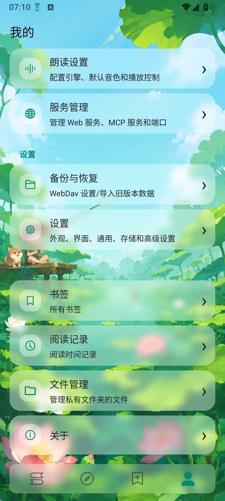
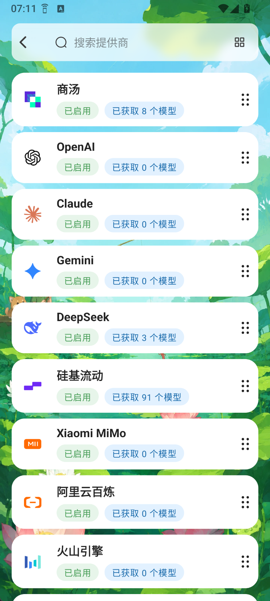
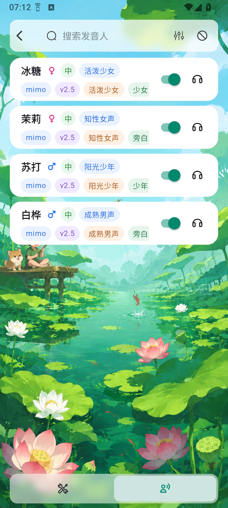
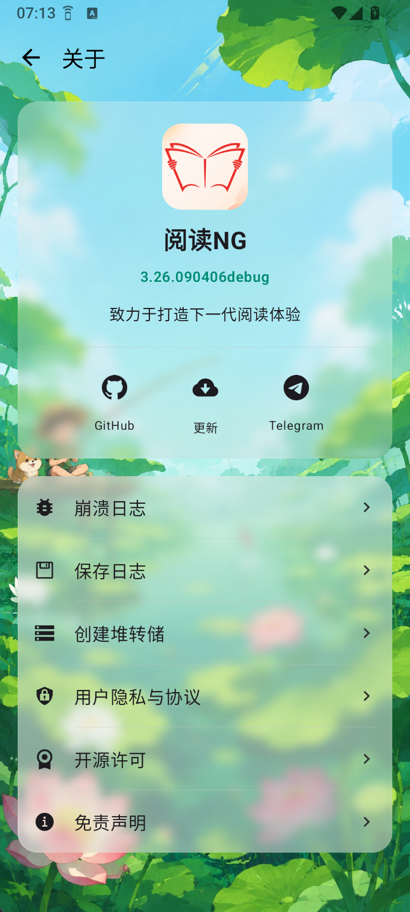

# 阅读 NG · Legado NG

### Next Generation Legado

**致力于打造下一代阅读体验**

保留自定义书源、本地阅读与高度可定制能力， 
带来统一的 NG 界面、AI 辅助阅读、多角色听书与动态主题体验。

**[下载最新版](https://github.com/joestar817/legado_NG/releases/latest)** ·
**[使用帮助](app/src/main/assets/web/help/md/appHelp.md)** ·
**[交流反馈](https://t.me/+lYttMZGrQ1RkOTE1)** ·
**[English](English.md)**

## 为什么选择 Legado NG

- **更现代、美观的 UI**：主要页面经过重新设计，提供统一的 NG 界面与丰富的主题效果。
- **融入 AI 生态**：支持 AI 净化、AI 扫书、阅读助手、Skills、工具调用与 MCP。
- **完全重构的 TTS 体系**：重新设计朗读引擎、发音人和角色音色管理，支持多人朗读与有声书播放。

## 核心能力

|  | 功能 | 说明 |
| :---: | --- | --- |
| 📖 | 在线与本地阅读 | 支持自定义书源、多源搜索、发现、换源、目录与正文规则，也可扫描或导入本地 TXT、EPUB 文件 |
| 🗂️ | 书架与书籍管理 | 支持列表、网格、分组、排序、阅读记录、书签、关联作品和单本书快捷操作 |
| 🎨 | NG 界面与主题 | 支持透明／液态玻璃视觉体系、柔光与动态场景主题、独立阅读配色、悬浮控件和多种翻页方式 |
| ✨ | AI 阅读辅助 | 支持段落／章节净化、替换规则生成、书籍分析、角色卡和基于当前书籍上下文的对话 |
| 🎧 | 多角色听书 | 支持系统及在线朗读引擎、角色分镜、音色路由、跨章播放、预缓存、进度跳转与有声书离线缓存 |
| 🧩 | 书源与规则 | 支持书源导入、编辑、登录、分组、批量操作、步骤调试，以及替换规则分组、作用域和生效结果查看 |
| 🔌 | AI 与扩展能力 | 支持多 AI 提供商、Skills、工具调用和内置 MCP 服务，为书籍、章节、缓存与上下文提供扩展入口 |
| ☁️ | 数据与配置 | 支持 WebDAV 备份恢复，以及书源、订阅源、主题、阅读排版和朗读引擎配置导入 |
| 🛠️ | 调试与日志 | 支持书源步骤调试、代码高亮、调试日志、网络日志、敏感信息脱敏和日志导出 |

## 当前状态

Legado NG 本轮主要界面与体验重构已基本收口，当前重点转向稳定性、兼容性、性能和细节打磨。

- 基础阅读、书架、搜索换源、规则管理、设置与备份等主要流程可正常使用。
- AI、在线朗读和 MCP 能力需要用户自行配置相应服务。
- 隔离式 QuickJS 仅用于少量有特殊需求的 JS 书源，目前属于实验性能力。
- 新功能与界面细节仍会根据实际使用反馈继续调整。

## UI 展示

以下截图展示“我的”、AI 提供商、发音人管理和关于页面，不包含书架作品或正文内容。

  
  
  
  

## 下载与开始使用

前往 **[GitHub Releases](https://github.com/joestar817/legado_NG/releases/latest)** 下载最新 APK。

首次使用时，可以导入自己的书源或订阅源，也可以直接导入本地 TXT／EPUB 文件。AI 与在线朗读能力均为可选配置，不影响基础阅读功能。

Legado NG 使用独立包名前缀，可与阅读原版、阅读 Sigma 同时安装，应用数据相互独立。

| 类型 | 包名 |
| --- | --- |
| 对外分发版 | `io.legado.app.ng.release` |
| 调试版 | `io.legado.app.ng.debug` |

## 项目关系

Legado NG 基于 Legado 生态及阅读 Sigma 的历史代码基础持续演进，保留规则生态与高度自定义能力，同时独立推进 NG 界面、AI 阅读、多角色听书和动态主题等方向。

项目名称中的“NG”代表 **Next Generation**，中文名称统一使用“阅读 NG”，英文名称统一使用“Legado NG”。

## 使用须知

Legado NG 只提供阅读器、规则引擎和相关管理工具，不提供任何书籍、书源、订阅源或其他内容服务。

应用中的网页访问、自定义规则、第三方书源、订阅源及其他外部数据均由用户自行配置或导入。项目开发者不制作、不维护、不分发第三方内容源，也无法保证第三方数据的合法性、可用性或安全性。

使用者应遵守所在地法律法规，并自行确认和承担所使用数据来源及内容的责任。

## 交流与帮助

- [下载最新版](https://github.com/joestar817/legado_NG/releases/latest)
- [应用更新日志](app/src/main/assets/updateLog.md)
- [使用帮助](app/src/main/assets/web/help/md/appHelp.md)
- [Telegram 交流反馈群组](https://t.me/+lYttMZGrQ1RkOTE1)
- [GitHub Issues](https://github.com/joestar817/legado_NG/issues)

反馈问题时，建议同时提供应用版本、Android 版本、复现步骤，以及必要的日志或截图。

## 动态主题与动效素材来源

Legado NG 的“湖畔樱花”“好奇猫咪”动态主题及播放器“雨夜”动效，使用了由 Wallpaper Engine 创意工坊社区作品适配而来的场景素材。本项目免费开源，不单独销售这些素材：

- “湖畔樱花”：取材自 [Workshop 3056182945「樱花」](https://steamcommunity.com/sharedfiles/filedetails/?id=3056182945)
- “好奇猫咪”：取材自 [Workshop 3455074362「4K Curious Cats (PHONE)」](https://steamcommunity.com/sharedfiles/filedetails/?id=3455074362)
- “雨夜”：取材自 [Workshop 3503882817「Convenience Store in the Rain」](https://steamcommunity.com/sharedfiles/filedetails/?id=3503882817)

原作品著作权归各自作者所有。如权利人认为相关使用不当，请通过项目 Issue 或交流渠道联系我们，我们会及时删除或替换相关素材。

## 致谢

Legado NG 的演进离不开 Legado 生态及众多优秀开源项目：

- [gedoor/legado](https://github.com/gedoor/legado) — Legado 原项目，为规则生态和核心阅读能力奠定了基础。
- [Luoyacheng/legado-E](https://github.com/Luoyacheng/legado-E) — 阅读 Sigma，Legado NG 最初的直接代码基础。
- [Rimchars/legado](https://github.com/Rimchars/legado) — 阅读Archive，AI 多角色分镜与角色化朗读的重要灵感来源，也为部分旧设备兼容性问题的定位和修复提供了参考。
- [LegadoTeam/legado](https://github.com/LegadoTeam/legado) — 阅读 Beta，Legado NG 的单文件 JavaScript 书源支持直接参考了其实现。
- [skybbk1001/legadoT](https://github.com/skybbk1001/legadoT) — 阅读 T；Legado NG 所参考的单文件 JavaScript 书源方案最初由该项目作者实现。
- [HapeLee/legado-with-MD3](https://github.com/HapeLee/legado-with-MD3) — 主题体系相关设计参考。
- [rikkahub/rikkahub](https://github.com/rikkahub/rikkahub) — AI Provider、模型配置和聊天体验的重要参考。
- 感谢本项目使用的所有开源依赖、素材作者、贡献者和测试者。

## 许可证

项目源代码基于 [GNU General Public License v3.0](LICENSE) 开源。第三方素材的权利归各自作者所有，并按上方来源说明使用和处理。

---

如果 Legado NG 对你有帮助，欢迎点亮一个 ⭐，让更多喜欢自由阅读、AI 辅助与多人听书的人发现它。

**[Star](https://github.com/joestar817/legado_NG)** ·
**[Releases](https://github.com/joestar817/legado_NG/releases/latest)** ·
**[Community](https://t.me/+lYttMZGrQ1RkOTE1)**

