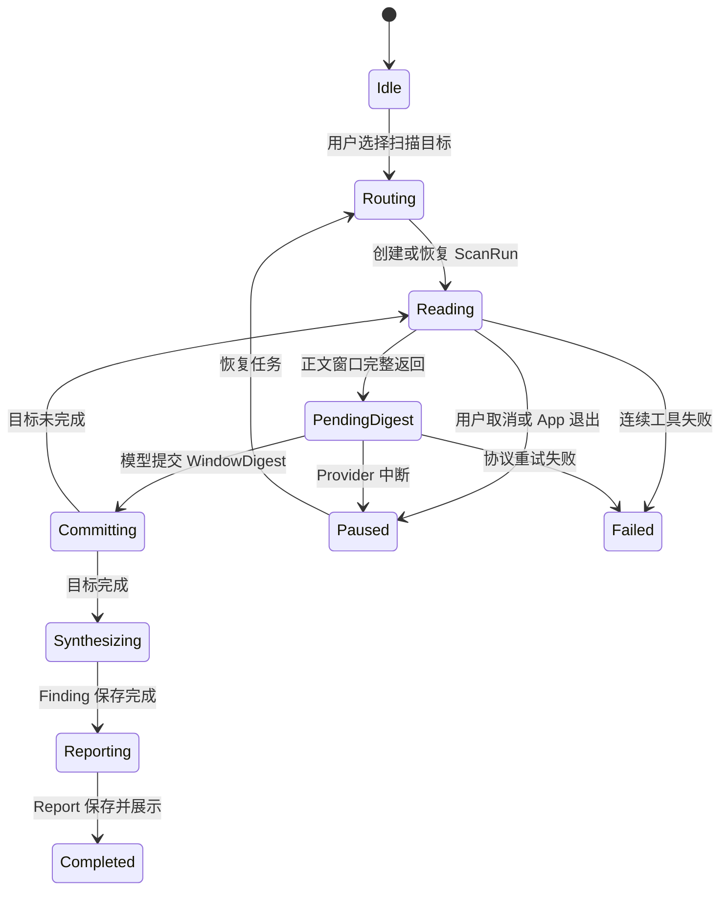

# AI 扫书 v2：可恢复长任务与分层分析方案（已废弃）

> 2026-07-14：本方案已撤回，不能作为实现依据。下文中的 `SCAN_CHECKPOINT` 仅保留为历史设计记录，不代表当前能力。当前扫书业务以 `app/src/main/assets/skills/book_scan/` 多文件包为唯一真相；可恢复语义状态统一写入通用 AgentMemory，专用 Mode 仅配置通用 `core.memory_flush` 回执约束，不再提供独立 checkpoint MCP、表或 Hook。

## 1. 背景

当前 `book_scan v25` 已覆盖快速定位、连续扫描、术语匹配、人物弧、心理活动、决策分析、报告展示和交互入口，但真实设备测试暴露出以下结构性问题：

- 正文已经完整返回，不代表模型成功保存了对应语义档案。
- 模型漏掉 `book_scan_delta` 时，App fallback 仍会推进章节覆盖，最终可能出现“正文覆盖 100%，结构化事件严重不足”。
- 正文工具结果加入上下文后可能立即触发 MidTurn 自动压缩，模型尚未生成窗口摘要和事实，当前窗口的语义细节可能只剩通用压缩摘要。
- `scan_100/scan_300` 的目标主要依赖模型遵守提示词，模型可能在没有真实异常的情况下主动提前结束。
- 事件、维度信号和 unresolved 采用追加或整项替换，难以可靠表达跨窗口补证、反转、关闭和版本冲突。
- 最终报告依赖长任务残余上下文，人物弧、关系伦理和决策逻辑容易在压缩后退化成几个显眼剧情标签。

v2 的目标不是继续增加规则，而是先建立可靠的数据协议和扫描状态机，再重写单文件 Skill。

## 2. 设计目标

### 2.1 功能目标

1. 每个完整正文窗口都有可验证的结构化语义记录。
2. 扫描 100 章、300 章或全部已有章节时，可以持续执行、暂停和恢复。
3. 自动压缩不得发生在“正文已经返回、WindowDigest 尚未提交”的不安全区间。
4. 人物弧、感情关系、重大决策、作品承诺和阅读压力可以跨窗口累积、反转和关闭。
5. 最终报告只依赖持久化档案，不依赖长任务残余上下文。
6. App 只负责协议、覆盖、事务、恢复和通用阶段守卫，不判断具体雷点。
7. NG 当前继续使用单文件 Skill，不以多文件 Skill 支持作为前置条件。

### 2.2 非目标

- v1 扫书记忆的兼容迁移。
- 用户画像和个人规则匹配。
- 将联网书评作为作品事实来源。
- 扫书 UI 的大规模重做。
- 多文件 Skill 包加载能力。

项目仍处于内部开发阶段，v2 验证时直接清理旧 `book_scan` 记忆并重新扫描。

## 3. 职责边界

### 3.1 App 可以负责

- 验证正文是否完整返回。
- 计算正文覆盖和语义覆盖。
- 持久化 ScanRun、pending window 和 next gap。
- 校验扫描目标是否完成。
- 控制自动压缩的安全点。
- 校验 schema、revision、run、window 和 delta 幂等键。
- 在事务中保存 WindowDigest、Fact、ThreadRevision 和覆盖状态。
- 模型提前结束或协议缺失时发起通用纠错重试。
- 显示确定性的扫描进度。
- 扫描完成后启动独立综合分析请求。

### 3.2 App 不得负责

- 判断绿帽、送女、漏女等业务术语。
- 判断人物是否崩塌、降智或圣母。
- 根据关键词自动升级风险。
- 改写模型输出的 severity 或 Finding。
- 从可见自然语言报告反推业务事实。
- 自动生成雷点结论。

### 3.3 Skill 和模型负责

- 从正文提取可证实或证伪的事实。
- 维护跨窗口主题线的结构化修订。
- 在综合阶段根据事实和主题线生成 Finding。
- 根据项目术语口径解释 Finding。
- 基于持久化分析结果生成用户可见报告。

## 4. 单文件 Skill 的三种运行模式

v2 不使用五个模型阶段，收敛为三种执行模式。

### 4.1 `ROUTE`

负责：

- 读取 manifest 和 active run。
- 判断是快速定位、继续扫描还是分析当前。
- 创建或恢复扫描目标。
- 找到第一个语义覆盖缺口。
- 在安全点调用第一个正文窗口。

不负责：

- 生成完整报告。
- 判断全书雷点。
- 在扫描目标未明确时读取大量正文。

### 4.2 `SCAN_CHECKPOINT`

每次只处理一个约 20 章的连续正文窗口：

1. 接收正文工具结果。
2. 提取一个 WindowDigest。
3. 输出隐藏 `book_scan_delta`。
4. 当前窗口事务保存成功后，才允许调用下一正文窗口。

中间 checkpoint 禁止输出：

- 可见批次报告。
- `legado-interaction`。
- 全书人物弧结论。
- 长期雷点结论。
- 六类作品画像。
- 全量术语匹配结果。

### 4.3 `SYNTHESIS_REPORT`

扫描目标完成后，使用新的请求上下文执行：

```text
系统提示词
+ 单文件 book_scan Skill
+ 已完成的 ScanRun 状态
+ manifest / window / fact / thread 查询工具
```

该请求不携带此前数百章原始正文工具输出，负责：

- 分页读取相关 WindowDigest、Fact 和 ThreadRevision。
- 聚合当前 Thread 状态。
- 生成或更新 Finding。
- 生成六类作品画像。
- 输出唯一可见报告和下一步交互入口。

这是扫描任务完成后的确定性阶段切换，不是在连续扫描中随意裁剪上下文。

## 5. 扫描状态机



允许的运行状态：

```text
idle
running
paused
failed
completed
cancelled
```

## 6. ScanRunState

```json
{
  "run_id": "scan_xxx",
  "work_key": "书名\n作者",
  "action": "scan_300",
  "status": "running",
  "phase": "scan_checkpoint",
  "target": {
    "start_semantic_count": 100,
    "required_new_count": 300,
    "completed_new_count": 140
  },
  "next_gap": {
    "start": 240,
    "end": 400
  },
  "pending_window": null,
  "manifest_revision": 12,
  "retry_count": 0,
  "created_at": 0,
  "updated_at": 0
}
```

扫描目标不能只存在于聊天上下文或压缩摘要中。模型无工具调用但目标未完成时，App 仅执行协议纠错：要求从 `next_gap` 继续并提交窗口增量，不生成任何业务判断。

## 7. ScanManifestV2

```json
{
  "schema_version": 2,
  "work_key": "书名\n作者",
  "source_revision": "revision_xxx",
  "revision": 18,
  "book": {
    "name": "书名",
    "author": "作者",
    "status": "ongoing",
    "total_chapters": 444
  },
  "text_coverage": {
    "covered_ranges": [],
    "missing_ranges": [],
    "covered_count": 444
  },
  "semantic_coverage": {
    "covered_ranges": [],
    "missing_ranges": [],
    "covered_count": 210,
    "extractor_version": 2
  },
  "synthesis": {
    "status": "stale",
    "manifest_revision": 18,
    "semantic_count": 210,
    "latest_report_id": null
  },
  "active_run_id": null,
  "updated_at": 0
}
```

### 7.1 完成状态

| 状态 | 判定条件 |
|---|---|
| 正文读取完成 | `text_coverage.missing_ranges=[]` |
| 语义扫描完成 | `semantic_coverage.missing_ranges=[]` |
| 综合分析完成 | synthesis 覆盖当前 semantic revision |
| 完整报告有效 | Report 引用当前 synthesis revision |

禁止再用单个 `completed` 同时表达正文、语义、综合和报告状态。

fallback 只能推进 `text_coverage`，不能推进 `semantic_coverage`。

## 8. WindowDigest

每个正文窗口必须对应一个唯一 Digest：

```json
{
  "schema_version": 2,
  "payload_type": "window_digest",
  "delta_id": "delta_xxx",
  "run_id": "scan_xxx",
  "base_manifest_revision": 12,
  "window": {
    "window_id": "window_xxx",
    "chapter_indexes": [210, 211],
    "chapter_hashes": {
      "210": "hash",
      "211": "hash"
    },
    "source_revision": "revision_xxx",
    "extractor_version": 2
  },
  "material_change": true,
  "summary": "本窗口中性摘要",
  "facts": [],
  "thread_revisions": [],
  "open_questions": []
}
```

没有重要变化时也必须输出：

```json
{
  "material_change": false,
  "facts": [],
  "thread_revisions": []
}
```

只有 WindowDigest 成功保存后，对应章节才能进入 `semantic_coverage`。

### 8.1 幂等键

```text
window_id = hash(work_key + source_revision + chapter_indexes + chapter_hashes + extractor_version)
delta_id  = hash(window_id + normalized_payload)
```

重复提交同一 `delta_id` 必须 no-op。

## 9. Fact

Fact 是正文可以证实或证伪的原子断言，不携带最终风险结论。

### 9.1 八类 Fact

```text
character_state
relationship_state
decision
harm_loss
recovery_payoff
narrative_promise
plot_event
content_occurrence
```

### 9.2 结构

```json
{
  "fact_key": "local_001",
  "kind": "decision",
  "subtype": "political_marriage_choice",
  "event_group_key": "marriage_event_001",
  "subjects": ["角色A"],
  "objects": ["阵营B"],
  "assertion": "角色在组织危机下接受政治婚姻",
  "assertion_status": "asserted",
  "story_range": {
    "start": 434,
    "end": 442
  },
  "evidence_refs": [],
  "supersedes_fact_ids": []
}
```

Fact 不包含：

- 严重度。
- 是否属于雷点。
- 人设崩塌、作者强行或注水等推断。
- 读者应该产生何种评价。

同一剧情可以产生多个原子 Fact，并使用 `event_group_key` 关联。例如强制婚姻可以同时产生关系状态、重大决策和伤害事实，不必压成一个不可继续分析的事件。

## 10. EvidenceRef

```json
{
  "evidence_id": "evidence_xxx",
  "window_id": "window_xxx",
  "chapter_index": 434,
  "source_revision": "revision_xxx",
  "chapter_hash": "hash",
  "role": "occurrence",
  "locator": {
    "paragraph_start": 120,
    "paragraph_end": 126
  }
}
```

`role`：

```text
occurrence  事件发生
support     支持此前判断
refute      否定此前判断
closure     事件或关系收束
```

后续反转不覆盖旧 Fact，而是新增 Fact，并通过 `refute/closure/supersedes` 建立关系。

## 11. ThreadRevision

跨章节主题线使用追加式 revision，不直接覆盖历史证据。

### 11.1 Thread 类型

```text
character
relationship
decision
expectation
reader_pressure
```

### 11.2 示例

```json
{
  "thread_id": "character:角色A:marriage_arc",
  "thread_type": "character",
  "revision": 4,
  "state": "open",
  "subjects": ["角色A"],
  "fact_ids": [
    "fact_arc_established",
    "fact_marriage_choice"
  ],
  "snapshot": {
    "established_direction": "摆脱被当作联姻工具",
    "current_choice": "为解决组织危机接受政治婚姻",
    "transition_evidence": [],
    "alternatives": [],
    "agency_gain": "unknown",
    "exit_right": "unknown"
  },
  "closed_by_fact_ids": [],
  "closure_reason": null
}
```

Thread 状态：

```text
open
closed
superseded
```

关闭必须引用 `closed_by_fact_ids` 和明确 `closure_reason`，不能依赖自由文本 unresolved 自动消失。

## 12. Finding

Finding 是综合分析阶段对 Fact 和 Thread 的二次推导。

```json
{
  "finding_id": "finding_xxx",
  "rule_id": "character.arc_regression",
  "status": "candidate",
  "severity": "high",
  "confidence": 0.82,
  "thread_ids": ["character:角色A:marriage_arc"],
  "supporting_fact_ids": [],
  "refuting_fact_ids": [],
  "summary": "角色当前选择可能与此前反抗工具化的成长方向冲突",
  "reader_impact": "重视人物成长连续性的读者可能认为人物弧出现倒退",
  "boundary": "后续若补足真实替代方案、主动计划和对等收益，结论可能调整",
  "synthesis_revision": 3
}
```

Finding 状态：

```text
candidate
confirmed
resolved
reversed
```

状态更新由新 revision、证据时间顺序和支持/反证关系决定，不能由置信度高低决定。

## 13. Report

Report 是指定 revision 的展示快照，不是新的事实来源。

```json
{
  "report_id": "report_xxx",
  "report_type": "full_scan",
  "manifest_revision": 18,
  "semantic_coverage": {
    "covered_count": 444,
    "total_count": 444
  },
  "synthesis_revision": 3,
  "finding_ids": [],
  "open_thread_ids": [],
  "generated_at": 0
}
```

以下变化会让旧 Report 进入 `stale`：

- 新增语义覆盖。
- 章节内容 hash 变化。
- 新增或反转 Fact。
- Thread 更新或关闭。
- Finding 更新。
- Skill 分析规则版本变化。

## 14. WindowDigest 事务边界

一个 WindowDigest 必须在同一 Room 事务中完成：

1. 校验 `run_id`。
2. 校验 `base_manifest_revision`。
3. 校验 pending window。
4. 校验章节完整读取证据和内容 hash。
5. 写入 WindowDigest。
6. 写入 Fact。
7. 写入 ThreadRevision。
8. 推进 semantic coverage。
9. 更新 ScanRun 进度和 next gap。
10. 更新 manifest revision。
11. 清除 pending window。

任一步失败，整个窗口不得计入语义完成。

第一版限制同一本书同一时刻只有一个 active scan run。分析已有结果可以并发读取，但不得修改扫描事实。

## 15. 自动压缩安全点

### 15.1 允许压缩

- 创建 run 后、读取第一个正文窗口前。
- 前一 WindowDigest 事务提交后、读取下一窗口前。
- SCAN 完成后、进入 SYNTHESIS 前。
- synthesis 分页批次提交后。

### 15.2 禁止压缩

```text
正文工具结果已经返回
但对应 WindowDigest 尚未成功保存
```

### 15.3 预留窗口预算

读取下一窗口前估算：

```text
当前上下文
+ 下一正文窗口预留 token
+ WindowDigest 输出预留 token
```

接近压缩阈值时先压缩，再调用正文工具。

### 15.4 极端溢出恢复

若正文结果意外超过预留：

1. 保留 pending window 的原始 tool message。
2. 只压缩 pending window 之前的历史。
3. 不压缩当前正文结果。
4. 重试生成 WindowDigest。
5. 若仍超过 Provider 窗口，标记该窗口失败并明确原因。

不得截断章节正文后将其标记为完整语义分析。

## 16. 隐藏协议

继续沿用 `book_scan_delta` 代码块，根据 `payload_type` 分派，避免增加多套协议入口。

### 16.1 窗口增量

```book_scan_delta
{
  "schema_version": 2,
  "payload_type": "window_digest"
}
```

### 16.2 综合分析增量

```book_scan_delta
{
  "schema_version": 2,
  "payload_type": "synthesis",
  "findings": [],
  "thread_revisions": []
}
```

### 16.3 输出顺序

扫描中间响应：

```text
隐藏 WindowDigest
+ 下一正文工具调用
```

扫描目标完成：

```text
最后一个隐藏 WindowDigest
```

保存成功后，由 App 启动独立 `SYNTHESIS_REPORT` 请求。

综合分析完成：

```text
可见报告
+ 隐藏 synthesis delta
+ interaction
```

## 17. 单文件 Skill 重写目标

NG 当前只支持单文件 Skill。v2 的 `book_scan.md` 目标控制在约 500～600 行、约 6K token 内，结构为：

```text
1. 任务边界
2. 三模式路由表
3. ROUTE 规则
4. SCAN_CHECKPOINT 规则
5. WindowDigest schema
6. 八类 Fact 与五类 Thread
7. SYNTHESIS_REPORT 规则
8. 精简术语映射表
9. 报告骨架
10. interaction 协议
```

删除或合并：

- 重复核心原则。
- 重复报告前核对。
- 多份相似报告模板。
- 每个术语的长段解释和重复示例。
- 扫描阶段不需要的全局推理示例。
- 与 checkpoint 冲突的“每次回复都必须有 interaction”。

## 18. 实施阶段

### Phase 0：协议定稿

- 冻结 schema v2 字段。
- 冻结 ScanRun 状态机。
- 冻结 WindowDigest 事务边界。
- 冻结自动压缩安全点。
- 冻结状态转换和错误恢复表。

### Phase 1：数据与状态机

- 新增 v2 DTO，所有协议字段显式 `@SerializedName`。
- 新增 ScanRun 持久化。
- 实现 text/semantic 双覆盖。
- 实现 WindowDigest 事务保存。
- 实现 revision、delta 幂等和单书单 run。
- 明确清理 v1 扫书记忆，不增加隐式兼容兜底。

### Phase 2：长任务控制

- 实现 pending window。
- 调整自动压缩安全点。
- 实现扫描目标完成校验。
- 实现提前结束协议纠错。
- 实现 Provider 失败和进程中断恢复。

### Phase 3：单文件 Skill 重写

- 改为三模式路由。
- 每窗口输出隐藏 checkpoint。
- 使用八类 Fact 和 ThreadRevision。
- 将风险综合移出扫描阶段。
- 精简术语和报告模板。

### Phase 4：独立综合分析

- 扫描完成后构建新的综合分析请求上下文。
- 分页读取 WindowDigest、Fact 和 Thread。
- 保存 Finding 和 Report revision。
- 生成唯一可见报告和交互入口。

### Phase 5：端到端评测

至少使用：

- 《天之下》：人物弧、政治联姻、心理和决策争议。
- 《李庄生同学不想重生》：既往关系、长期纠缠、叙事期待落差。
- 一本轻松低风险作品：控制误报。
- 一本长篇连载作品：测试长任务和目录增长。
- 一本存在死亡复活或关系反转的作品：测试状态反转和关闭。

## 19. 验收标准

### 19.1 协议正确性

- 完整正文窗口的 WindowDigest 保存率：100%。
- 截断章节误计：0。
- fallback 推进 semantic coverage：0。
- 重复 delta 产生重复 Fact：0。
- revision 冲突静默覆盖：0。
- `confirmed → resolved/reversed` 状态不一致：0。

### 19.2 长任务

- `scan_100` 精确完成 100 章或全部剩余章节。
- `scan_300` 精确完成 300 章或全部剩余章节。
- 自动压缩后 run、next gap 和 pending window 恢复率：100%。
- Provider 单次失败恢复后不重复推进覆盖。
- App 被杀后可从已提交 checkpoint 恢复。

### 19.3 分析质量

- 高危事件基准召回率不低于 95%。
- 人物弧基准事实链召回率不低于 90%。
- 关系反转状态正确率：100%。
- 同一事件重复风险卡：0。
- 无证据虚构 Finding：0。

### 19.4 性能

- 每章平均输入 token 相比 v25 至少下降 30%。
- 分别记录扫描和 synthesis 的 token 消耗。
- 记录每 100 章压缩次数。
- 记录端到端 p50/p95 耗时。

## 20. 实施前置结论

在 schema v2、ScanRun 状态机、自动压缩安全点和 WindowDigest 事务边界完成评审前，不先修改现有 `book_scan.md`。本方案确认后，优先实施 Phase 1 和 Phase 2，再重写 Skill 和最终报告。
