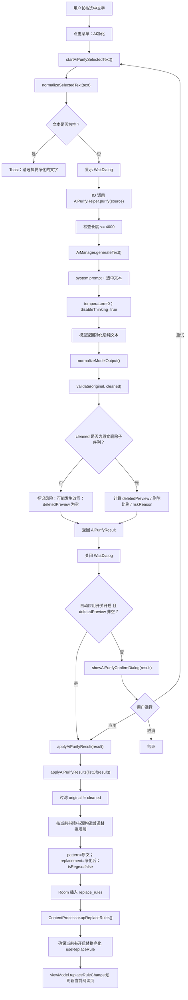

# AI 净化流程图

本文档记录当前 AI 净化实现的两条主流程，用于后续规划功能落地。状态基于 2026-06-20 当前代码：长按选中文本触发段落净化，阅读页底部 AI 按钮触发章节净化。

## 段落净化流程

## 章节净化流程

```mermaid
flowchart TD
    A["用户点击底部 AI 主按钮"] --> B["展开子按钮：净化章节"]
    B --> C["onClickAiPurifyChapter()"]
    C --> D["startAiPurifyChapter()"]
    D --> E{"当前章节是否已加载完成？"}
    E -- "否" --> E1["Toast：章节未加载完成"]
    E -- "是" --> F["读取 ReadBook.curTextChapter.paragraphs"]
    F --> G["normalizeSelectedText(paragraph.text)"]
    G --> H["过滤空段落"]
    H --> I["显示 WaitDialog"]
    I --> J["IO 调用 AiPurifyHelper.purifyParagraphs(paragraphs)"]

    J --> K["为每段生成 BatchInput：id=index+1"]
    K --> L{"单段长度是否 <= 4000？"}
    L -- "否" --> L1["失败：段落过长"]
    L -- "是" --> M["按 MAX_BATCH_INPUT_LENGTH=8000 分块"]
    M --> N["逐块顺序调用 purifyBatch(inputs)"]

    N --> O["构造 JSON 数组请求"]
    O --> P["system prompt 要求只返回需净化段落"]
    P --> Q["模型返回 JSON 数组"]
    Q --> R["解析 cleaned / text / content 字段"]
    R --> S{"某 id 是否缺失？"}
    S -- "是" --> S1["该段按原文保留"]
    S -- "否" --> T["validate(original, cleaned)"]
    S1 --> U["得到批量结果"]
    T --> U

    U --> V{"批量未变化 且原文含明显污染标记？"}
    V -- "是" --> W["调用单段 purify(input.text) 复核"]
    V -- "否" --> X["保留批量结果"]
    W --> Y{"复核成功？"}
    Y -- "是" --> Z["使用单段复核结果"]
    Y -- "否" --> X
    Z --> AA["合并所有段落结果"]
    X --> AA

    AA --> AB["ReadBookActivity 过滤 deletedPreview 非空结果"]
    AB --> AC{"是否有候选？"}
    AC -- "否" --> AC1["Toast：AI 未发现需要净化的内容"]
    AC -- "是" --> AD["关闭 WaitDialog"]
    AD --> AE{"自动应用开关开启？"}
    AE -- "是" --> AF["applyAiPurifyResults(results)"]
    AE -- "否" --> AG["showAiPurifyChapterConfirmDialog(results, elapsed)"]

    AG --> AH["候选默认全选；只显示原文和净化后"]
    AH --> AI{"用户选择"}
    AI -- "应用" --> AF
    AI -- "取消" --> AJ["结束"]

    AF --> AK["过滤 original != cleaned"]
    AK --> AL["每条候选创建普通替换规则"]
    AL --> AM["pattern=原段落；replacement=净化后；isRegex=false"]
    AM --> AN["显式设置 id=当前时间+index，避免冲突覆盖"]
    AN --> AO["Room 批量插入 replace_rules"]
    AO --> AP["ContentProcessor.upReplaceRules()"]
    AP --> AQ["确保当前书开启替换净化 useReplaceRule"]
    AQ --> AR["viewModel.replaceRuleChanged() 刷新当前阅读页"]
```

## 当前差异与规划关注点

- 段落净化是单次请求；章节净化是按段落分块后的顺序批量请求，不是并发请求。
- 两条流程最终都不是直接改章节内容，而是写入普通替换规则：`pattern=原文`、`replacement=净化后`、`isRegex=false`。
- 章节净化会在弹窗前丢弃 `deletedPreview` 为空的结果，因此模型如果发生非删除式改写，会被过滤掉。
- 段落净化的手动确认路径目前只要 `original != cleaned` 就可应用；即使校验认为“可能发生改写”，用户点应用仍会写规则。
- 章节批量模式存在漏召回风险；当前只对含圈号、括号编号、异常符号等结构性污染标记的未变化段落追加单段 AI 复核。
- 本地逻辑只做候选筛选、校验和规则落库，不做本地文本改写；真正净化内容来自 AI 返回。
