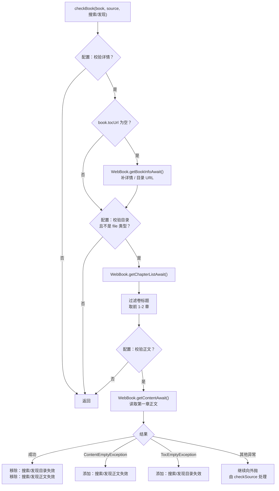

# 书源校验当前流程

本文档记录当前书源批量校验实现，便于理解校验入口、执行流程和分组写入规则。状态基于 2026-06-24 当前代码。

## 总览

当前校验不是独立的健康结果表，而是把校验结论写回 `BookSource.bookSourceGroup`。失败类分组会混在用户自定义分组里，例如 `搜索失效`、`网站失效`、`校验超时`。

```mermaid
flowchart TD
    A["书源管理页选中书源"] --> B["点击：校验"]
    B --> C["输入搜索关键词<br/>可打开校验设置"]
    C --> D["CheckSource.start()<br/>传入选中书源 URL"]
    D --> E["CheckSourceService 启动"]

    E --> F{"已有校验任务？"}
    F -- "是" --> F1["Toast：已有书源在校验"]
    F -- "否" --> G["按 AppConfig.threadCount 并发校验"]

    G --> H["逐个读取 BookSource"]
    H --> I["checkSource(source)"]
    I --> J["withTimeout(CheckSource.timeout)"]
    J --> K["doCheckSource(source)"]

    K --> K1["Debug.startChecking(source)"]
    K1 --> K2["清除旧失效分组<br/>清除旧 // Error 注释"]

    K2 --> L{"配置：校验域名？"}
    L -- "是" --> L1{"bookSourceUrl 是 http<br/>且 Socket 可连接？"}
    L1 -- "否" --> L2["添加：域名失效<br/>抛出源地址不可访问"]
    L1 -- "是" --> L3["移除：域名失效"]
    L -- "否" --> M
    L3 --> M

    M{"配置：校验搜索？"}
    M -- "是" --> M1{"searchUrl 非空？"}
    M1 -- "否" --> M2["添加：搜索链接规则为空"]
    M1 -- "是" --> M3["取校验关键词<br/>优先 ruleSearch.checkKeyWord"]
    M3 --> M4["WebBook.searchBookAwait()"]
    M4 --> M5{"搜索结果为空？"}
    M5 -- "是" --> M6["添加：搜索失效"]
    M5 -- "否" --> M7["移除：搜索失效<br/>取第一本书 checkBook(搜索)"]
    M -- "否" --> N
    M2 --> N
    M6 --> N
    M7 --> N

    N{"配置：校验发现<br/>且 exploreUrl 非空？"}
    N -- "是" --> N1{"能取到发现分类 URL？"}
    N1 -- "否" --> N2["添加：发现规则为空"]
    N1 -- "是" --> N3["WebBook.exploreBookAwait()"]
    N3 --> N4{"发现结果为空？"}
    N4 -- "是" --> N5["添加：发现失效"]
    N4 -- "否" --> N6["移除：发现失效<br/>取第一本书 checkBook(发现)"]
    N -- "否" --> O
    N2 --> O
    N5 --> O
    N6 --> O

    O["汇总当前分组中<br/>包含“失效”或等于“校验超时”的名称"]
    O --> P{"存在失败分组？"}
    P -- "是" --> P1["抛出 NoStackTraceException"]
    P -- "否" --> Q["校验成功"]

    P1 --> R["失败处理"]
    L2 --> R
    J -- "超时" --> R
    R --> R1{"异常类型"}
    R1 -- "TimeoutCancellationException" --> R2["添加：校验超时"]
    R1 -- "ScriptException / WrappedException" --> R3["添加：js失效"]
    R1 -- "其他非 NoStackTraceException" --> R4["添加：网站失效"]
    R1 -- "NoStackTraceException" --> R5["不额外添加网站失效"]

    R2 --> S
    R3 --> S
    R4 --> S
    R5 --> S
    S{"配置：写入错误注释？"}
    S -- "是" --> S1["bookSourceComment 前置 // Error: ..."]
    S -- "否" --> T["Debug.updateFinalMessage(校验失败)"]
    S1 --> T

    Q --> U["Debug.updateFinalMessage(校验成功)"]
    T --> V["写入 respondTime"]
    U --> V
    V --> W["DAO update(bookSource)"]
    W --> X["通知 / EventBus 刷新进度"]
```

## 详情、目录、正文校验

搜索或发现拿到第一本书后，会进入 `checkBook()`。搜索链路失败写入 `搜索目录失效` / `搜索正文失效`，发现链路失败写入 `发现目录失效` / `发现正文失效`。

## 校验配置

| 配置项 | 默认值 | 影响 |
| --- | --- | --- |
| 超时时间 | 180 秒 | 单个书源 `doCheckSource()` 的总超时时间。 |
| 写入错误注释 | 开启 | 失败时在 `bookSourceComment` 前置 `// Error: ...`。 |
| 校验域名 | 关闭 | 开启后用 Socket 检测 `bookSourceUrl` 的 host/port 可连接性。 |
| 校验搜索 | 开启 | 使用搜索规则和校验关键词搜索书籍。 |
| 校验发现 | 开启 | 如果 `exploreUrl` 非空，取第一个发现分类拉列表。 |
| 校验详情 | 开启 | 搜索/发现拿到书后，必要时拉取详情。 |
| 校验目录 | 开启 | 拉取目录并检查是否为空。 |
| 校验正文 | 开启 | 拉取第一章正文并检查是否为空。 |

## 基础自动分组

书源管理页批量菜单中的 `自动分组` 是静态字段分组，不发起网络请求，也不判断真实登录态、代理需求、验证码或反爬状态。当前会覆盖所选书源的 `bookSourceGroup`，写入以下分组：

| 分组名 | 触发条件 | 说明 |
| --- | --- | --- |
| `小说` | `bookSourceType` 为默认文本类型 | 类型基础分组，所有书源都会先写入一个类型分组。 |
| `漫画` | `bookSourceType == image` | 类型基础分组。 |
| `音频` | `bookSourceType == audio` | 类型基础分组。 |
| `视频` | `bookSourceType == video` | 类型基础分组。 |
| `其它` | `bookSourceType == file` | 类型基础分组。 |
| `<base URL>` | 当前已安装的全部书源中，通过阅读现有 URL 拼接与 `NetworkUtils.getBaseUrl()` 取得相同 base URL 的不同完整书源 URL 至少有 2 个 | 路径、查询参数和 `#` 后缀按最终 URL 拼接口径忽略。例如 `http://192.168.11.10:8080#lm` 与 `http://192.168.11.10:8080#icon` 都追加 `http://192.168.11.10:8080` 分组；只修改本次选中的书源。 |
| `有登录入口` | `loginUrl` 非空 | 只表示书源声明了登录入口，不等同于运行时必须登录。 |
| `无搜索` | `searchUrl` 为空 | 表示该源不支持搜索规则，可能仍支持发现或直接书籍 URL。 |
| `有发现` | `exploreUrl` 非空 | 表示该源声明了发现规则。 |
| `事件监听` | `eventListener == true` | 表示该源启用了事件监听，规则复杂度相对更高。 |
| `WebView` | 完整书源规则字段中命中 WebView 语法，例如 URL option `webView: true`、`@webjs:`、`java.webView*()`、`webView*Await()`，或正文规则 `webJs` 非空 | 表示该源会使用 WebView 参与请求/解析；这类源更可能和登录态、CF 校验、人机验证或动态页面有关。 |

`可登录`、`功能按钮`、`需登录`、`需代理`、`CF校验`、`验证码`、`频控` 等需要更明确的语义分析或运行时诊断，不能只靠基础自动分组准确判断。

## 校验后分组表

| 分组名 | 写入位置 | 触发条件 | 是否会参与最终失败判断 | 备注 |
| --- | --- | --- | --- | --- |
| `域名失效` | `doCheckSource()` 域名阶段 | 开启域名校验后，`bookSourceUrl` 是 http 地址但 Socket 无法连接 host/port。 | 是 | 如果 `bookSourceUrl` 不是 http 链接，会直接抛出 `源地址不是http链接`，当前代码不会先写入该分组。 |
| `搜索链接规则为空` | `doCheckSource()` 搜索阶段 | 开启搜索校验，但 `source.searchUrl` 为空。 | 否 | 该分组不包含 `失效`，最终失败汇总不会因为它抛错；但列表 UI 会把 `规则为空` 当异常类文字显示。 |
| `搜索失效` | `doCheckSource()` 搜索阶段 | 开启搜索校验，`searchUrl` 非空，但 `WebBook.searchBookAwait()` 返回空列表。 | 是 | 搜索返回非空时会移除该分组，并继续校验第一本搜索结果。 |
| `发现规则为空` | `doCheckSource()` 发现阶段 | 开启发现校验，`exploreUrl` 非空，但解析不到可用发现分类 URL。 | 否 | 和 `搜索链接规则为空` 一样，不参与最终失败汇总。 |
| `发现失效` | `doCheckSource()` 发现阶段 | 开启发现校验且发现分类 URL 非空，但 `WebBook.exploreBookAwait()` 返回空列表。 | 是 | 发现返回非空时会移除该分组，并继续校验第一本发现结果。 |
| `搜索目录失效` | `checkBook(搜索)` | 搜索结果进入详情/目录校验后，目录获取抛出 `TocEmptyException`。 | 是 | `checkBook()` 成功时会同时移除 `搜索目录失效` 和 `搜索正文失效`。 |
| `搜索正文失效` | `checkBook(搜索)` | 搜索结果进入正文校验后，正文获取抛出 `ContentEmptyException`。 | 是 | 只在开启正文校验时可能写入。 |
| `发现目录失效` | `checkBook(发现)` | 发现结果进入详情/目录校验后，目录获取抛出 `TocEmptyException`。 | 是 | `checkBook()` 成功时会同时移除 `发现目录失效` 和 `发现正文失效`。 |
| `发现正文失效` | `checkBook(发现)` | 发现结果进入正文校验后，正文获取抛出 `ContentEmptyException`。 | 是 | 只在开启正文校验时可能写入。 |
| `校验超时` | `checkSource()` 失败处理 | 单个书源整体校验超过 `CheckSource.timeout`。 | 是 | 这是唯一不包含 `失效` 但会参与最终失败识别的分组。 |
| `js失效` | `checkSource()` 失败处理 | 校验过程中抛出 `ScriptException` 或 Rhino `WrappedException`。 | 是 | 用于规则 JS 执行异常，不区分具体阶段。 |
| `网站失效` | `checkSource()` 失败处理 | 校验过程中抛出非 `NoStackTraceException`、非超时、非 JS 的其他异常。 | 是 | 这是兜底分组，很多网络、解析或未知异常都会落到这里。 |

## 当前实现边界

- 校验结果直接写入 `bookSourceGroup`，没有独立的校验结果表或历史记录。
- 每次校验开始会清理旧的失败类分组：分组名包含 `失效` 或等于 `校验超时` 会被移除；`搜索链接规则为空`、`发现规则为空` 不会在开始阶段统一清理，只会在对应规则变为可用时移除。
- 最终是否失败只看当前分组名是否包含 `失效` 或等于 `校验超时`。
- 搜索和发现各自只取第一本结果继续校验详情、目录、正文。
- 详情、目录、正文阶段只把 `TocEmptyException` 和 `ContentEmptyException` 映射成更细分的目录/正文失效；其他异常会继续向外抛，最终可能变成 `js失效` 或 `网站失效`。
- 批量校验使用并发执行，和单个书源调试页的交互式链路不同；高并发下可能触发站点频控、验证码或反爬，但当前分组无法区分这些原因。
