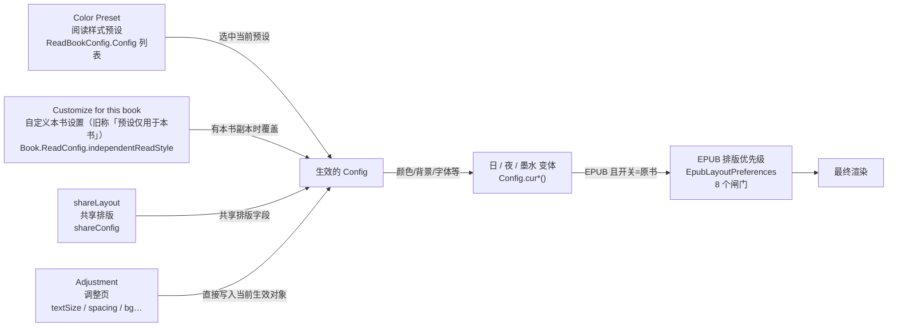
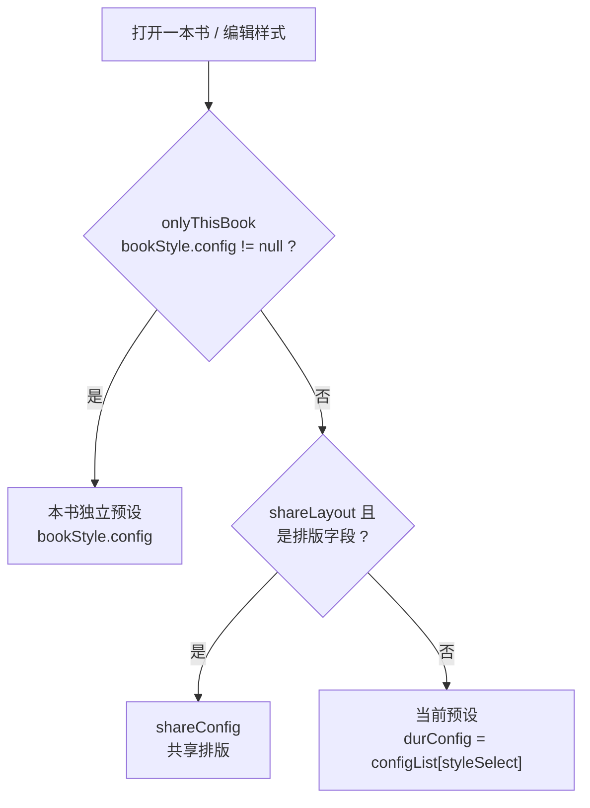
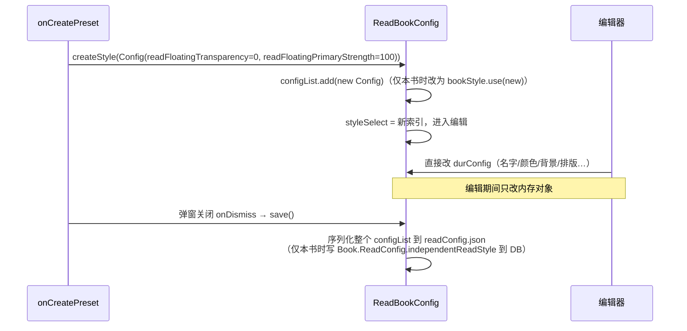
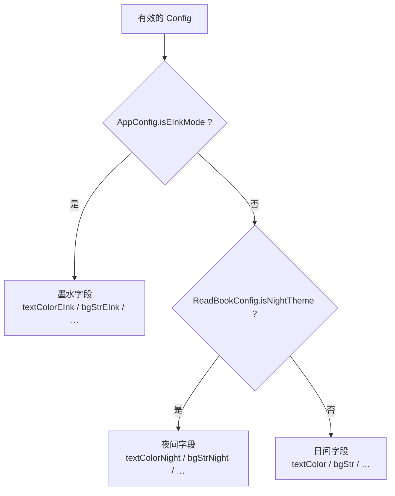
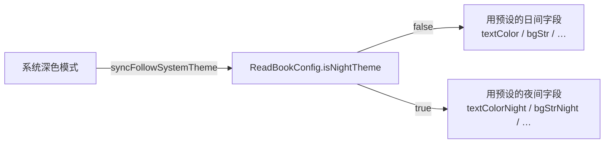
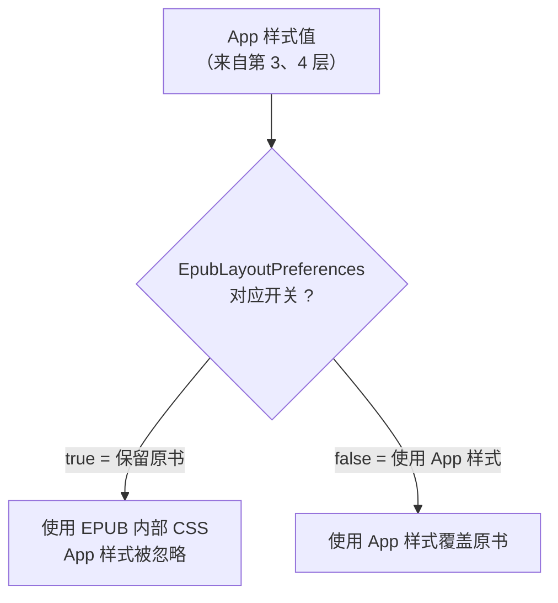
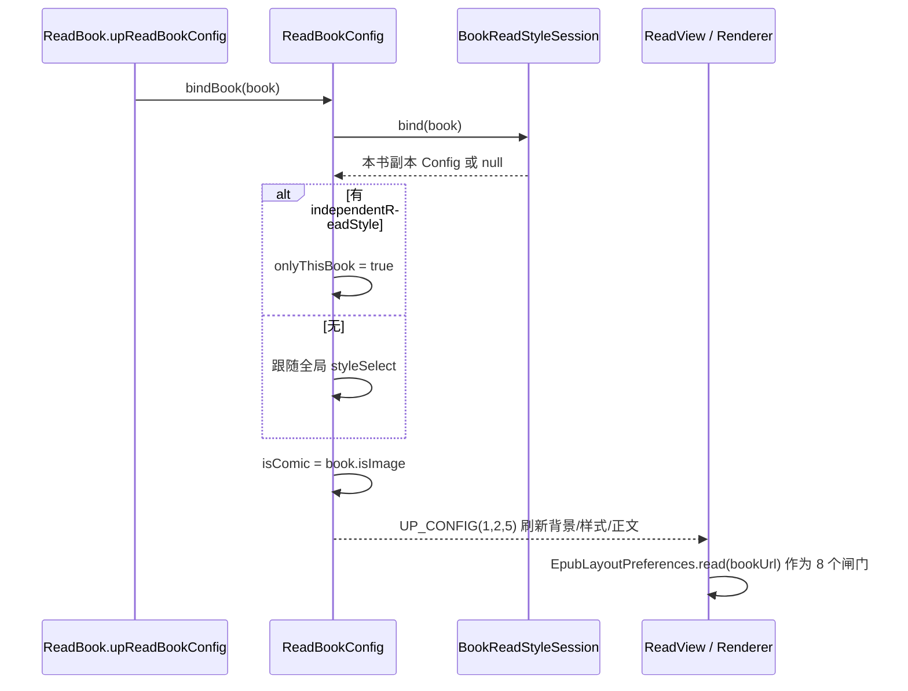
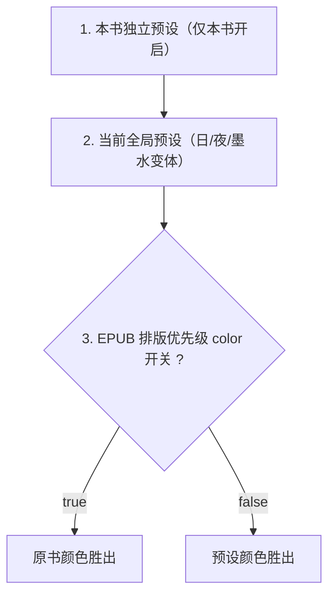

# 阅读显示配置关系：Color Preset / EPUB 排版优先级 / 仅本书 / 调整

> 适用代码：`io.legado.app.help.config.ReadBookConfig`、`BookReadStyleSession`、
> `EpubLayoutPreferences`、`ui.book.read.config.ReadStyle*`、`ui.book.read.page.ReadView`。

## 1. 概览

这些功能都围绕同一件事：**“当前这本书最终用哪一套显示参数，以及每个参数要不要听原书的。”**



## 2. 四个功能是什么

| 功能 | UI 入口 | 数据与代码 |
|------|---------|-----------|
| **Color preset（阅读样式预设）** | 样式 → 「预设」页 | `ReadBookConfig.Config` 列表（`configList`，持久化在 `readConfig.json`）。每套预设含文字颜色/背景/强调色（日、夜、墨水三套变体）、字体、字号、间距、页眉页脚、下划线等。`styleSelect` / `comicStyleSelect` 决定当前选中。 |
| **Adjustment（调整）** | 样式 → 「调整」页 | 快捷修改当前生效 `Config` 的常用字段：字号、字重、字距、行距、段距、翻页动画、背景等。handler 写 `ReadBookConfig.textSize` 等，最终落到 `config`。 |
| **Customize for this book（自定义本书设置，旧称「预设仅用于本书」）** | 预设页开关 | `BookReadStyleSession` + `Book.ReadConfig.independentReadStyle`（存 DB）。开启时把当前预设 `copyForBook()` 复制为本书独立副本；之后编辑/调整都改这份副本；关闭则 `followGlobal()` 回到全局预设。 |
| **EPUB precedence（EPUB 排版优先级）** | EPUB 阅读页「排版优先级」面板 | `EpubLayoutPreferences`：按 `bookUrl` 存 8 个布尔开关（publisher、font、size、color、decoration、paragraph、title、initial），默认全 true（听原书的）。 |

浮动窗取色是否跟随 App 在 **默认 Tab**（「浮动窗跟随 App」），见 [3.1](#31-预设页全局开关跟随应用颜色)。「共享排版」开关已从 UI 移除。

### 2.1 设置界面 UI 一览（ASCII）

阅读样式抽屉整体（`ReadStyleScreen` + `ReadStyleDock`，三个根页面：预设 / 调整 / 高亮）：

```
┌──────────────────────────────────────────────┐
│  阅读样式 (NgGlassSurface 圆角抽屉)            │
│  ┌──────────┬──────────┬──────────┐           │
│  │  预设     │  调整     │  高亮     │ ← 顶部 Tab │
│  └──────────┴──────────┴──────────┘           │
│                                               │
│  （按当前 Tab 显示对应页面；子页面如编辑/取色页    │
│    会整页替换，顶部 Tab 隐藏）                    │
└──────────────────────────────────────────────┘
```

透过抽屉看正文的 **面板** 滑条在放弃/完成上方（session-only，不接浮动外观）。

**预设页（PRESET）**

```
┌──────────────────────────────────────────────┐
│  预设卡片横向滚动（LazyRow，一屏约 5 张）        │
│  ┌──────┐ ┌──────┐ ┌──────┐ ┌──────┐          │
│  │预设1  │ │预设2  │ │预设3  │ │预设4  │ …        │
│  │(文字+  │ │      │ │(选中  │ │      │          │
│  │ 背景) │ │      │ │ 描边) │ │      │          │
│  └──────┘ └──────┘ └──────┘ └──────┘          │
│  新建     编辑     导入     导出     删除         │
│  ─────────────────────────────────            │
│  自定义本书设置                  [开关]  ← 仅当有书绑定 │
│  本书字体 / 恢复跟随当前预设      ← 仅自定义本书 │
│  语言字体                                 >   │
│  ─────────────────────────────────            │
│  EPUB 排版                                >   │
│  ─────────────────────────────────            │
│  清空并恢复预设                  ← 仅非自定义本书 │
└──────────────────────────────────────────────┘
```

**调整页（ADJUST）**

```
┌──────────────────────────────────────────────┐
│  快捷卡片行（横向等分）：                         │
│  [字重]  [字体]  [缩进]  [简繁]  [页边距]  [更多] │
│  字号        ───────●────────  18              │
│  字距        ──────●─────────  0.1             │
│  行距        ──────●─────────  1.2             │
│  段距        ──────●─────────  0.2             │
│  翻页动画    [左右翻页      ▾]                   │
│  …（更多滑块/选项）                              │
└──────────────────────────────────────────────┘
```

**编辑预设页（EDIT）**

```
┌──────────────────────────────────────────────┐
│ ←  编辑预设                    [☀ 日间]  ← 可点击切换 │
│  名称: [预设名称______________]                 │
│  ─────────────────────────────────            │
│  下划线样式                    关闭  >          │
│  颜色                                          │
│  [文字颜色]   [背景颜色]   [强调色]               │
│  背景                                          │
│  背景透明度        ──────●────  100%            │
│  背景图片  [选图][图1][图2][图3]…（横向滚动）      │
│  浮动外观 / 取色来源 …（跟随应用颜色接管时置灰）    │
└──────────────────────────────────────────────┘
```

**颜色编辑页（EDIT_TEXT_COLOR / 背景 / 强调色共用 `NgInlineColorPicker`）**

```
┌──────────────────────────────────────────────┐
│ ←  文字颜色                         [↺]        │
│  ┌────────────────────────────────┐           │
│  │ 13×8 色板（高度按剩余空间封顶， │           │
│  │ 横屏不会挤出输入框）            │           │
│  └────────────────────────────────┘           │
│  [■]   #3E3D3B   ← 预览色块 + ARGB/Hex 输入框  │
└──────────────────────────────────────────────┘
```

相对祖先 jaredrummler 的精度差距、三通道 **色板 / 色轮 / 连续** 与配色入口的 **手动 | AI**（先公式随机再短句；VDT+WCAG 闸门；标题可滑文字→背景→高亮），见 [docs/color-picker-tabs-note.md](color-picker-tabs-note.md)。

**EPUB 排版面板（`EpubLayoutSheet`，三态档案）**

```
┌──────────────────────────────────────────────┐
│  EPUB 排版                                     │
│  尊重出版方                                 ✓  │
│  覆盖出版方                                    │
│  自定义                                        │
│  （选「自定义」时展开 8 行明细开关：              │
│   原书排版优先 ← publisher                      │
│   原书字体/原书字号/原书文字颜色/原书背景与装饰   │
│   /原书段落格式/标题特殊样式/首字特殊样式）        │
│  恢复默认                                      │
└──────────────────────────────────────────────┘
```

> 白盒注记：三态是 8 个存储布尔的**投影**——全 true=尊重、全 false=覆盖、其余=自定义（`EpubFormattingProfileContract`，含双向 `resolve`/`respectFlagsFor`，CUSTOM 恒等不写入）。存储仍是 `EpubLayoutPreferences` 的 8 个布尔，渲染行为与旧 8 开关 UI 完全等价。`publisher` 开关**不下发 JS**，仅在 Kotlin 侧决定是否向排版层传 `readerStyle`（`EpubLayoutController.kt:664`）；其余 7 项经 `features` 传入 `assets/epub/reader.js` 的 `applyFeaturePolicy()`。

**阅读浮动工具栏（主题模式/取色相关的侧边栏）**

```
┌────────────────────────────────┐
│ 亮度        [自动] ▓▓▓▓░░        │
│ 主题模式: [跟随系统][日间][夜间]   │ ← 决定日/夜变体
│ 翻页模式  [仿真][滑动][覆盖]…     │
│ （浮动栏取色受“跟随应用颜色”控制）  │
└────────────────────────────────┘
```

## 3. 生效对象的选择层级



代码对照：

```kotlin
// 阅读渲染取色/取背景用的对象
val durConfig: Config
    get() = bookStyle.config ?: getConfig(styleSelect)

// 调整页写入的对象
val config: Config
    get() = bookStyle.config ?: if (shareLayout) shareConfig else durConfig
```

> 白盒注记：`durConfig` 实为带 setter 的 `var`（`ReadBookConfig.kt:133-144`）——非仅本书时 setter 写 `configList[styleSelect]`，且 shareLayout=ON 时**同步整体覆写 `shareConfig`**。`config` getter 在 shareLayout=ON 时把全部写入导向 `shareConfig`，而颜色渲染只读 `durConfig`。

字段类别差异：

- **颜色/背景**：始终来自 `durConfig`（本书副本或所选预设）；`shareLayout` 不影响颜色。
- **排版字段**（字体、字号、字重、字距、行距、段距、标题样式等）：开启共享排版后由 `shareConfig` 提供；导出预设时 `getExportConfig()` 也会把这些字段替换为 `shareConfig` 的值。

### 3.1 预设页全局开关（跟随应用颜色）

`shareLayout`（共享排版）**已不在预设页 UI 上**（状态仍从 Dialog 传入，无开关行）。「浮动窗跟随 App」在默认 Tab，即改即存；自定义本书时置灰并显示原因，不再隐藏。

#### 共享排版（shareLayout，无 UI）

- ON：排版字段统一由 `shareConfig` 提供；颜色/背景仍来自当前预设。
- OFF：全部字段来自当前预设。
- 存 pref `shareLayout`，全局。

#### 跟随应用颜色（readFloatingFollowAppGlobally）

控制的是**阅读浮动工具栏/悬浮按钮的取色来源**，不是正文文字和背景颜色。

```kotlin
val floatingColorManagedGlobally get() = !onlyThisBook && readFloatingFollowAppGlobally
```

取色解析（`resolveEffectiveReadFloatingColor`）：

| 场景 | seed | followsApplication | colorStyle |
|------|------|--------------------|------------|
| 墨水屏 | 0 | false | 预设自己的 |
| **开关 ON（且非仅本书）** | **0** | **true** | **全局 `readFloatingGlobalColorStyle`** |
| 开关 OFF | 预设 `readFloatingSeed`（日）/ `readFloatingSeedNight`（夜） | 预设 follow-night | 预设 `readFloatingColorStyle` |

效果：

- **ON**：所有预设的浮动栏取色统一跟随 App 主题颜色；各预设自己的浮动 seed 被忽略，编辑页“跟随应用 / 背景取色”选项变灰并提示“取色来源已由全局设置接管”。此时开启“仅本书”，复制出的本书副本会把浮动 seed 重置为 0、follow-night=true、取色风格用全局值。
- **OFF**：每个预设各自决定浮动栏颜色（编辑页可选“跟随应用 / 背景取色”和取色风格 VIBRANT / EXPRESSIVE / RAINBOW / FRUIT_SALAD）。
- **“仅本书”开启时**：该开关在 UI 隐藏，`floatingColorManagedGlobally` 恒为 false——本书副本自己管浮动颜色。
- **墨水屏**：开关无效果（seed=0、followsApplication=false、用预设取色风格）。

一句话：**它是浮动栏取色的全局总开关；ON = 所有预设浮动栏颜色跟随 App，OFF = 每个预设各自决定。**

### 3.2 「自定义本书设置」开启后，哪些设置被复制

开启时执行 `bookStyle.use(durConfig.copyForBook(config))`：外观类字段（颜色/背景/状态栏/浮动外观）取自当前预设 `durConfig`，排版字段取自 `config`（若开共享排版则来自 `shareConfig`）。

| 类别 | 是否进入本书副本 | 说明 |
|------|------------------|------|
| **颜色**（文字色/强调色/背景色，含日/夜/墨水三套变体） | ✅ 是 | 来自当前预设 `durConfig` |
| **背景**（背景图/背景类型/透明度） | ✅ 是 | 同上 |
| **字体/排版**（字体、字号、字重、字距、行距、段距、翻页动画、标题样式、下划线、页边距等） | ✅ 是 | 来自 `config`；若开了「共享排版」则来自 `shareConfig` |
| **状态栏图标深浅 / 浮动外观**（浮动按钮取色、透明度、强度） | ✅ 是 | 一并复制；若全局跟随 App 则重置为跟随 |
| **Adjustment（调整页修改的字段）** | ✅ 是 | 调整页直接改当前生效 Config，开启后全部写进本书副本 |
| **Highlight（高亮规则）** | ❌ 否 | 高亮规则由全局 `ReadHighlightRuleStore` 持有，所有书、所有预设共享；副本中 `highlightRules` 被置空 |
| **EPUB 排版优先级开关** | ❌ 否 | `EpubLayoutPreferences` 是另一套按书设置，不随副本复制 |
| **阅读主题模式（日/夜/跟随系统）** | ❌ 否 | 全局设置，不在预设里 |
| **预设名称/预设管理** | ⚠️ 特殊 | 副本沿用当前预设名，但不在全局 `configList` 中；预设页显示一个「本书」条目，编辑的是副本 |

一句话总结：**颜色、字体、调整、背景、浮动外观 → 全进本书副本；高亮 → 全局共享；EPUB 排版优先级 → 独立按书存。**

### 3.3 新建 / 保存一个预设，实际存了什么

**新建流程**：



**一个预设 = 一整个 `ReadBookConfig.Config` 对象**，保存时把整个 `configList` 序列化成 JSON 写入 `readConfig.json`。包括：

- 名字 `name`
- 背景：`bgStr` / `bgType`（日、夜、墨水三套）+ `bgAlpha`
- 颜色：`textColor` / `textAccentColor`（日、夜、墨水三套）
- 状态栏图标：`darkStatusIcon`（日、夜、墨水三套）
- 浮动外观：`readFloatingSeed`、透明度、强度、取色风格（日/夜种子分开）
- 排版：`textFont` / `titleFont` / `headerFont` / `footerFont`、`textBold`、`textSize`、`textItalic`、`textShadow` 及阴影参数、`letterSpacing`、`lineSpacingExtra`、`paragraphSpacing`
- 标题：`titleMode` / `titleSize` / `titleColor` 及间距、分段缩放等
- 页眉页脚：尺寸、颜色、边距、显示开关、`showHeaderLine` / `showFooterLine` 等
- 下划线：`underlineMode` / `underlineColor`（日/夜）/ 点线参数
- 翻页动画：`pageAnim`（墨水屏单独 `pageAnimEInk`）
- 其他：段落缩进、页边距、`ngUnknownFields` 等

**不存进预设的**：

| 内容 | 存哪里 |
|------|--------|
| 当前选中哪个预设（`styleSelect`） | 独立 pref `readStyleSelect` |
| 高亮规则 | 全局 `ReadHighlightRuleStore`（预设里的 `highlightRules` 字段仅用于旧数据兼容/导入导出传输） |
| 背景图文件本身 | 只存路径字符串，文件在 `externalFiles/bg/` |
| 日/夜模式（跟随系统/日/夜） | pref `readThemeMode`，全局 |
| 共享排版 `shareLayout` | pref，全局 |
| 跟随应用颜色 `readFloatingFollowAppGlobally` | pref，全局 |
| 仅本书开关 | `Book.ReadConfig.independentReadStyle`，按书 |
| EPUB 排版优先级 | `EpubLayoutPreferences`，按书 |

**保存时机**：编辑器的每次修改都即时写进内存里的 `Config`（`durConfig`）；真正落盘在样式弹窗关闭时的 `onDismiss → ReadBookConfig.save()`（仅本书时写 DB）。切书 `bindBook`、恢复默认等路径也会触发 `save()`。

## 4. 每个 Config 内部的日 / 夜 / 墨水变体



所有 `cur*()` / `setCur*()` 按 **墨水 → 夜间 → 日间** 的顺序选择。注意 `isNightTheme` 由阅读主题模式（侧边栏：跟随系统/日间/夜间）决定，与 App 整体主题是两套设置。

### 4.1 「跟随系统」是什么

阅读里的「跟随系统」（`ReadThemeMode.FOLLOW_SYSTEM`）**不改变预设、不改变任何字段值**，只决定一件事：当前生效的那套 Config 用**日间字段还是夜间字段**。



- 系统浅色 → `isNightTheme=false` → `cur*()` 读日间变体；
- 系统深色 → `isNightTheme=true` → 读夜间变体；
- 切换时由 `BaseReadBookActivity.onCreate` / `onWindowFocusChanged` / `SYSTEM_UI_MODE_CHANGED` 同步 `isNightTheme`，再刷新背景与正文。

两个容易混淆的“跟随系统”：

| 设置 | 作用域 | 影响 |
|------|--------|------|
| App 主题模式「常规模式」(`AppConfig.themeMode`) | 整个 App 界面（书架、设置、弹窗） | UI 深浅色 |
| 阅读主题模式「跟随系统」(`ReadBookConfig.readThemeMode`) | 阅读页文字/背景配色 | 用预设的日/夜变体 |

两者互相独立；阅读页只看后者。若 `readThemeMode` 缺失（例如恢复备份后，该 pref 不随备份恢复），**按 2026-10-04 决策 A 回落为 `FOLLOW_SYSTEM`**，而不是「日间」；未来全局默认值变化不会影响旧备份的恢复结果。详见 `docs/reading-settings-redesign-plan.md` §3.5 与 `BackupRestorePolicyTest`。

## 5. EPUB 排版优先级（最后一层闸门）

它不提供任何显示值，只决定**上面选出来的 App 样式对 EPUB 原书样式是否生效**。



- `ReadView` 将 `publisherStyle` 传给 EPUB 渲染器：
  `EpubLayoutPreferences.read(bookUrl)[PUBLISHER]`
- `EpubLayoutController` 将 8 个 `features` 传给 JS 排版层。
- 该开关按书保存（`epubLayout.<sha256(bookUrl)>`），**不属于任何预设，也不随“仅本书”复制**。
- 级联细节（白盒注记）：即使尊重原书（font=true），App 仍注入零优先级默认表 `:where(html){font-family:…}`（`assets/epub/reader.js:1345-1357`）——**原书未声明样式的元素仍用 App 字体**；上图「App 样式被忽略」准确含义是「原书有 CSS 声明的元素上 App 值被忽略」。

8 个开关及默认值：

| key | 含义 | 默认 |
|-----|------|------|
| publisher | 是否尊重出版方排版 | true |
| font | 原书字体 | true |
| size | 原书字号 | true |
| color | 原书文字颜色 | true |
| decoration | 原书背景与装饰 | true |
| paragraph | 原书段落格式 | true |
| title | 标题特殊样式 | true |
| initial | 首字特殊样式 | true |

## 6. 打开一本书时的应用流程



## 7. 层级总结（以 EPUB 文字颜色为例）



对 TXT 等无内部样式的书，第 3 层不存在，直接由 1 → 2 决定。

## 8. 容易混淆的点

- **Color preset 的“颜色” ≠ EPUB 优先级的“color”**：前者是预设里存的颜色值；后者是“是否用原书文字颜色”的开关。
- **仅本书开关会生成当前预设的独立副本**（`independentReadStyle` / `durConfig`）作为显示基准，颜色/字体/调整/背景/浮动外观初始来自该副本；同时本书修改按属性写入 `independentOverrides`（稀疏覆盖），不扩散为整份拷贝。EPUB 优先级开关和高亮规则不跟着复制——EPUB 优先级是并行的按书设置，高亮规则是全局共享。
- **Adjustment 不是独立层**：它直接改动当前生效对象（本书副本 / shareConfig / 当前预设），改完即持久化到对应位置；不存在一个悬浮的“调整层”。
- **shareLayout 只共享排版字段**：颜色/背景仍来自当前预设或本书副本。
- **“浮动窗跟随 App”只影响浮动栏取色**：不影响正文文字/背景颜色；在默认 Tab 即改即存，自定义本书时置灰。
- **日/夜变体属于同一个 Config**：切日/夜不会切换预设，只在同一预设内部选择字段集。
- **“跟随系统”只切日/夜变体**：它不选预设、不改任何字段值；App 主题的「常规模式」与阅读的「跟随系统」是两套独立设置。
- **readThemeMode 缺失时回落为 `FOLLOW_SYSTEM`**：恢复备份后该 pref 不恢复时，阅读页会跟随系统日/夜模式，而不是固定为日间。
- **`epubLayout.*` 会随备份走 OTHER 模块**（`BackupModules.kt:46-68`），key 为 bookUrl 的 sha256，恢复后仅匹配同 bookUrl 的书。
