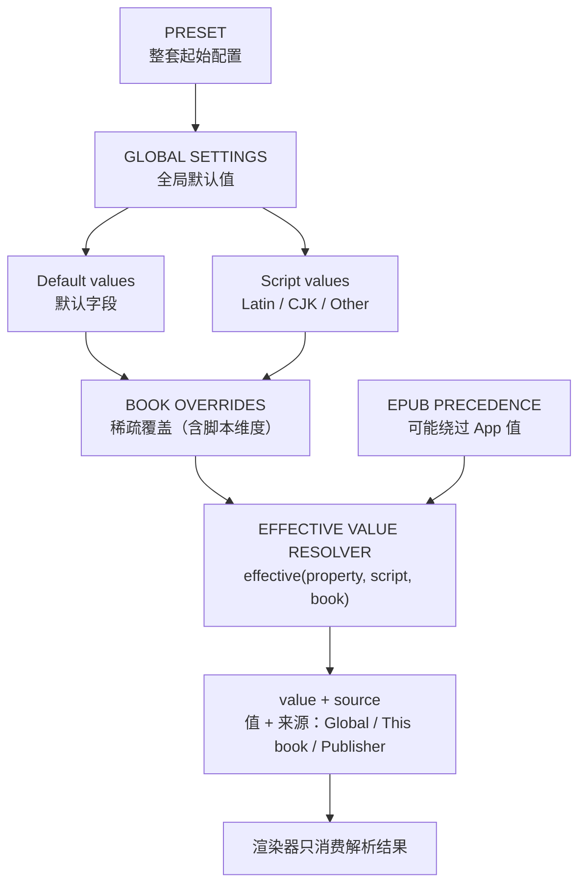

# 阅读设置重构设计计划 v2（Draft for discussion）

> 状态：v2 核心模型（预设/全局/本书/脚本/EPUB 闸门）维持已批准；**v2.1 白盒评审（2026-10）重开的 6 项契约已在 §3.7 决议**（重点：`basePreset` 默认 = 固定基准预设，`follow_global` 为显式选择）。Phase 0 契约测试按 §3.7 冻结后即可解封；Phase 1 UI 工作仍须在契约测试通过后开始。
> ① 本书基准预设 `basePreset`；② 脚本分类与中性字符策略；③ 脚本维度仅限正文 `textFont` 的范围声明；④ EPUB `Publisher` 来源的级联 caveat 与 UI 呈现；⑤ 字体加载缓存前置；⑥ myreader 语言映射桥接语义。
> Phase 0 契约测试暂缓定稿，待 §3.7 决议后一并冻结；Phase 1 UI 工作仍须在契约测试通过后开始。
> 关联文档：`docs/reading-display-settings.md`（现状分析）、`docs/typography-placement-proposal.md`（Language fonts 最终归属：preset + global fallback + book override）
> 范围：阅读样式/预设、本书覆盖、共享排版、语言（CJK/Latin/Other）字体、EPUB 排版优先级、调整页、导航与保存语义

## 1. 背景与目标

现状文档已确认：当前“预设 / 仅本书 / 共享排版 / 调整 / EPUB 优先级”在**行为上能工作**，但它们是**实现层概念的混合暴露**。本计划的目标是把它们收敛为：

> **一个统一有效值解析模型**，而不是一套“单一继承树”。

- 预设 = 整套起始配置；
- 全局 = 默认值；
- 本书 = 稀疏覆盖；
- CJK/Latin/Other = 脚本档案（初版只管字体）；
- EPUB 优先级 = 按书的“是否允许 App 覆盖”闸门；
- 调整 = 各域的快捷编辑，不再作为配置层；
- shareLayout = 从用户 UI 消失，并入全局 Typography。

**核心设计原则**：

> 预设选起点；全局定默认；本书只存稀疏覆盖；语言档案管字体；EPUB 规则决定书是否被允许覆盖；一切通过 `effective(property, script, book)` 解析。

## 2. 核心抽象：统一有效值解析模型

不再用“单一继承层级”这个说法。EPUB 优先级不是继承层，而是**优先级闸门**（precedence gate）。



解析器签名：

```text
effective(property, script, book) → (value, source)
```

三个独立概念：

| 概念 | 含义 | 取值 |
|------|------|------|
| **value** | 配置值 | `font = Noto Serif` |
| **source** | 值从哪里来 | 内部契约：`ThisBook` / `Preset` / `Global` / `Publisher` / `Platform`；UI 可归组显示 |
| **scope** | 值作用于哪个脚本 | `Default` / `Latin` / `CJK` / `Other` |

`source` 的完整契约（Phase 0 冻结，测试逐项断言）：

| source | 含义 | UI 显示建议 |
|--------|------|-------------|
| `ThisBook` | 本书稀疏 override | `This book` |
| `Preset` | 本书 pinned 基准预设（或 follow_global 时的当前预设） | `Preset: Default` |
| `Global` | 全局脚本档案 / 全局 default | `Global` |
| `Publisher` | EPUB 原书 CSS（该属性实际由原书声明） | `Publisher` |
| `Platform` | 平台字体回退 | `System` |

UI 的来源指示因此可以稳定渲染为：

```text
Noto Serif CJK SC
CJK · Preset: Default
```

或：

```text
Noto Serif CJK SC
CJK · This book
```

## 3. Phase 0：语义契约（动手改 UI 之前冻结）

### 3.1 有效值解析规则

非 EPUB 属性（完整解析顺序，含 preset 内部层级）：

```text
book.overrides[scope][property]        → 有则用之（source = ThisBook）     # 本书脚本级覆盖
book.overrides[default][property]      → 有则用之（source = ThisBook）     # 本书默认级覆盖；压过全局脚本档案
book.basePreset(scope, property)       → pinned 快照或 follow_global 当前预设（source = Preset）
  ├─ preset.scripts[scope]             → 有则用之（source = Preset）       # 预设级脚本字体覆盖
  └─ preset.default[property]          → 有则用之（source = Preset）       # 预设默认字体
global.scripts[scope][property]        → 有则用之（source = Global）
global.default[property]               → 用之（source = Global）
platform fallback                      → 最后兜底（source = Platform，非空）
```

- `book.basePreset` 对每个 `(scope, property)` 先查它自己的脚本档案，再查它自己的 default（预设内部层级 = 脚本档案 → default）。
- `follow_global` 模式：`book.basePreset` 解析到当前全局预设（仍记 `source = Preset`，UI 可显示 `Preset: Default`）。
- 预设脚本字体为**稀疏覆盖**：`null`/absent 表示该维度继承全局，有值则表示本预设显式覆盖。
- 详细设计见 `docs/typography-placement-proposal.md`。

EPUB 属性：

```text
resolved EPUB rule[property] == respect 且原书声明了该属性
    → publisher value（source = Publisher）
resolved EPUB rule[property] == respect 但原书未声明该属性
    → 走上面的 App 解析路径（级联 caveat）
resolved EPUB rule[property] == override
    → 走上面的 App 解析路径
```

### 3.2 本书覆盖语义

- `book.overrides` 只存**被改动的字段**；字段缺失 = 继承。
- 每个字段三态：`Global`（缺省）/ `Custom`（有值）/ 可 `↺` 重置回 Global（即删除该 override）。
- **不接受**“整份拷贝”作为长期模型。
- **basePreset 精确语义（v2.1 终审）**：
  - `pinned` 模式保存**当前预设的不可变快照**（或等价版本化引用），**不是**只存一个可能继续被编辑的 `presetId` 引用——否则用户编辑该预设会再次改变本书基准，重蹈旧模型覆辙。
  - `follow_global` 模式才解析到“当前全局预设”。
  - 表示法：`basePreset: { mode: pinned, snapshot: {...} }` 或 `{ mode: follow_global }`。
- **Appearance 允许被本书覆盖，但同样是属性级稀疏覆盖**，不允许整份 `appearance` 拷贝：

```yaml
book:
  overrides:
    appearance:
      day:   { bg: ... }     # 只存被改的属性
      night: { bg: ... }
      eink:  { bg: ... }
```

- **脚本档案只作用于 Typography**：Appearance 不出现 Latin/CJK/Other 维度（不做 Latin×Day/Night 组合爆炸）。

### 3.3 EPUB 三态用户策略 + 八项独立 precedence rules

顶层是**用户策略档位**，不是参与属性解析的第三级；`Custom` 把决策委托给**8 项独立规则**。

```text
Publisher formatting
  ● Respect publisher
  ○ Override publisher
  ○ Custom
      ├── Publisher       Respect / Override   ← 第 8 条规则（App 基础排版是否全面接管）
      ├── Font           Respect / Override
      ├── Font size      Respect / Override
      ├── Color          Respect / Override
      ├── Decoration     Respect / Override
      ├── Paragraph      Respect / Override
      ├── Title          Respect / Override
      └── Initial letter Respect / Override
```

`publisher` 是**第 8 条独立规则**（v2.1 白盒复审修正）：渲染层里 `publisher=false` 会额外强制 root/body 基础样式、段落 indent/align/margin 与背景透明化，独立于其余 7 项；它不是凌驾于 7 项之上的主闸。

- `publisher = respect`：不强制 App 基础排版；该规则自身决定 root/body 基础样式谁赢。
- `publisher = override`：App 全面接管基础排版；其余 7 项仍按各自取值生效。
- 渲染器只消费解析后的 8 条规则，不消费顶层档位。

语义不变量（Phase 0 用测试钉死）：

```text
mode == RESPECT  → 8 项全部 respect
mode == OVERRIDE → 8 项全部 override
mode == CUSTOM   → 8 项各自独立决定
```

- 迁移映射（确定性）：8 全 true → Respect；8 全 false → Override；其余（含 `(F, all-T)`、`(F, mixed)`）→ Custom。
- 8 条规则：publisher / font / size / color / decoration / paragraph / title / initial。
- **三态 profile 是 8 条 precedence rules 的投影**，不是独立的 publisher policy 加 7 条从属 rules；展开 Custom 是纯展示，不写任何存储（投影不得反向突变状态：打开面板 + 无交互 = 零存储变化 = 零渲染变化）。契约含双向：`resolve(flags→profile)` 与 `respectFlagsFor(profile, current→flags)`（CUSTOM 恒等返回 current），UI 机械消费。

### 3.4 脚本与字体回退语义

```text
script-specific font（CJK）
    ↓ absent
global default font
    ↓ unavailable
platform fallback
```

- `Other` 是**脚本分类**，不是回退机制；未来若做字形回退链，另设 `fallback.font`，不复用 `Other`。
- 数据模型预留 `fallback` 节点，但 Phase 3 不实现。

### 3.5 迁移不变量

1. 旧 `independentReadStyle`（整份 Config）**先作为不可变 `LegacyBookStyle` 兼容层**参与解析，**不做激进 diff**（旧模型无法区分“继承”与“显式设置成相同值”）。
2. 兼容优先、归一化后置：先让新解析器能消费旧数据、行为不变；后续再显式迁移/归一化为稀疏 overrides。
3. 旧字段保留不删，新字段读优先；保证可回滚。
4. `shareConfig` 迁移为 `global.typography` 后再关闭 `shareLayout`。
5. 备份/恢复、预设导入导出、`BackupRestorePolicyTest` 同步更新。

### 3.6 Phase 0 契约：优先级矩阵与测试表

Phase 0 不是“再设计”，而是**用测试冻结行为**。锁定的五个领域：

1. **有效值解析**：`effective(property, script, book) → (value, source)`；顺序 = global default → script-specific → book sparse override，EPUB 优先级按规则参与。
2. **稀疏本书覆盖**：缺失 = 继承（不是“重置为默认”）；显式设置成与继承值相同的值必须合法保留；Appearance 同样属性级稀疏；禁止整份拷贝。
3. **EPUB 优先级**：`publisher` 是第 8 条独立规则；Respect = 8 项全 respect；Override = 8 项全 override；Custom = 8 项各自独立；顶层档位永不成为解析层。
4. **脚本解析**：script font → global default font → platform fallback；`Other` 是脚本分类；`fallback.font` 只预留不实现。
5. **迁移不变量**：旧整份拷贝必须可读；`LegacyBookStyle` 兼容优先于有损归一化；新写入稀疏；无法证明来源时，绝不把显式旧值静默变成“继承”。

**优先级矩阵**（每个测试必须同时断言 `value` 和 `source`）：

```text
场景                  Book       Script      Global      Publisher
                      override   override    default     EPUB rule
──────────────────────────────────────────────────────────────────
normal                yes        -           -           -
normal                no         yes         -           -
normal                no         no          yes         -
EPUB / Respect        any        any         any         YES（publisher 赢）
EPUB / Override       any        any         any         NO（App 值赢）
EPUB / Custom         any        any         any         per-rule
```

**契约测试表（`EffectiveReadValueResolverTest` 的用例来源）**：

| # | 前置 | 期望 value | 期望 source |
|---|------|-----------|-------------|
| 1 | Global default font=A，Book 无覆盖，无 basePreset | A | Global |
| 2 | Global default font=A，Book default font=B | B | ThisBook |
| 3 | Global CJK=C，Global default=A，Book 无 CJK 覆盖 | C | Global（scope=CJK） |
| 4 | Global CJK=C，Book CJK=D | D | ThisBook（scope=CJK） |
| 5 | EPUB font=P，rule=respect，且原书声明了 font | P | Publisher |
| 6 | EPUB font=P，rule=override，Book CJK=D | D | ThisBook |
| 7 | EPUB font=P，mode=Custom，rule[font]=respect，且原书声明了 font | P | Publisher |
| 8 | 前置：Global default=A，Global CJK=C，Book CJK=D，publisher font=P，mode=Custom，rule[font]=override | D | ThisBook |
| 8b | 前置同上但 Book CJK 无覆盖 | C | Global（scope=CJK） |
| 9 | Latin→A，CJK→C，Other→B（混合文本） | 按 scope 各取各的 | 依 scope：Global/Preset/ThisBook |
| 10 | script font 缺失，default font 可用 | default font | Global |
| 10b | script font 缺失，default font 不可用 | PlatformFont | Platform |
| 10c | 空 context（platformFont 非空兜底） | platform | Platform（解析是全函数） |
| 11 | Book 显式设为与 Global 相同的值 | 该值 | ThisBook（显式保留） |
| 12 | Book override 缺失 | Global 值 | Global（继承，非“重置”） |
| 13 | LegacyBookStyle 存在且无新 overrides | 旧副本值 | Preset（Legacy 整份拷贝建模为 pinned 快照，与 Phase 5 归一化终态一致） |
| 14 | 自定义本书（默认）：basePreset=pinned(A 快照)，之后全局切换到预设 B 或编辑 A | 仍基于 A 快照的值 | Preset（基准固定） |
| 15 | 显式选择 follow_global：全局切换到预设 B | 基于 B 的值 | Preset（跟随当前预设；值同全局但来源标签不同，见 §3.7-1） |
| 16 | EPUB respect，但原书未声明该属性（级联 caveat） | App 解析值 | Global / ThisBook / Preset（非 Publisher） |
| 17 | pinned 预设 A 自身含 CJK=C；Book 无 CJK 覆盖 | C | Preset（scope=CJK） |
| 18 | Book default=X（未动脚本维度），Global CJK=C | X | ThisBook（本书 default 压过全局脚本档案） |
| 19 | EPUB respect + 原书声明 + pinned base | P | Publisher（EPUB 闸门高于基准层） |
| 20 | EPUB override + pinned base | 快照值 | Preset（App 路径落到基准层） |

**关键点：`source` 是契约的一部分，不只是 UI 元数据。** 解析器实现必须能机械地从这张表推导。

### 3.7 v2.1 白盒评审增补契约（须在 Phase 0 一并冻结）

1. **本书基准预设（basePreset）**：新增 `book.basePreset = { mode: pinned, snapshot } | { mode: follow_global }`。
   - **决议：开启「自定义本书设置」时，默认把当前预设保存为不可变快照基准（pinned snapshot，或等价版本化引用）**，不是只存 `presetId` 引用——后者在用户继续编辑该预设时会再次改变本书基准，重蹈旧模型覆辙。保留旧 `copyForBook` 的隔离语义：用户自定义过这本书后，全局切换/编辑预设不会静默改变本书外观。
   - `follow_global` 是**显式选择**，通过「恢复跟随全局当前预设」入口启用；不随自定义动作隐式产生。
   - **来源标签语义**：同一全局值，书带 `follow_global` 基准时 `source=Preset`（告诉用户“本书跟随预设”），无基准时 `source=Global`——值相同、标签不同，是有意区分（契约测试 15 钉死）。
   - 解析顺序：`book.overrides[scope] → book.overrides[default] → book.basePreset → preset.scripts → global.scripts → global.default → platform`。
   - **预设脚本字体**：`ReadPresetSnapshot.scriptFonts` 在 Phase 0 已预留，当前恒为 `emptyMap`；按 `docs/typography-placement-proposal.md` 决策，预设开始承载 `Latin/CJK/Other` 稀疏脚本字体覆盖，缺省即继承全局。
   - 旧 `independentReadStyle` 整份拷贝在语义上等价于「固定的 legacy 快照基准 + 空 overrides」，迁移期先作为 `LegacyBookStyle` 兼容层，不 diff；契约上 source 记 `Preset`（与 Phase 5 归一化终态一致，不单列 LEGACY 来源）。
2. **脚本分类与中性字符**：分类单位是**字符**（`Character.UnicodeScript`），不是整书语言检测。
   - CJK = Han / Hiragana / Katakana / Hangul + 全角形式（U+3000–303F、FF00–FFEF）；
   - Latin = Latin 系；
   - Neutral（Common/Inherited：半角标点、数字、空白）继承前一强脚本字符的字体，段首中性字符用 default 字体；
   - Other = 其余。
   - 已冻结为 `ReadScriptClassifier` 契约 + `ReadScriptClassifierTest`（Han/假名/谚文/全角、Latin、Neutral 继承、段首中性→DEFAULT、Greek/Cyrillic/Thai→Other）。
   myreader 的 `BookLanguageDetector`（整书语言检测）**不参与**新模型，仅在迁移时用。
3. **脚本维度只覆盖正文 `textFont`**：`titleFont` / `headerFont` / `footerFont` 不加脚本维度（标题通常单一语言；EPUB 标题走独立 `NGTitleFont`，`applyHeaderStyle` 耦合不变）。
4. **EPUB `Publisher` 来源的级联 caveat**：尊重原书时 App 仍注入零优先级默认表（`:where(html)`，`assets/epub/reader.js:1345-1357`），原书未声明样式的元素仍落回 App 字体。`source = Publisher` 的契约含义 = 「原书有声明的元素 publisher 赢」；契约测试按属性级闸门断言，渲染层按元素级级联实现。「原书字体 = 尊重」时，Language fonts 行须显示 Publisher 来源与「当前由原书 CSS 生效」提示。
5. **字体加载缓存前置**：现有 styled-range 字体**每次绘制重新解析字体文件**（`ChapterProvider.resolveStyledTypeface` → `createFromFile`，无缓存）。脚本字体会把这条路径放大到全书画笔，Phase 3 必须先落地以 `(path, weight, italic)` 为键的 typeface LruCache。
6. **myreader 语言映射桥接语义**：旧模型是 `script → 预设名` 绑定（`ReadStyleLanguageMap`，携带颜色/排版整套），新模型是 `script → 字体属性`。迁移只取被绑定预设的 `textFont` 写入 `global.typography.scripts.*.font`，其余属性不迁移（给用户的可见说明）；旧绑定数据保留一个版本期可回滚。

## 4. 目标数据模型

```yaml
global:
  preset: default
  appearance:                  # 日/夜/墨水三套变体保留
    theme: follow_system
    day:   { text_color, bg, accent, ... }
    night: { ... }
    eink:  { ... }
  typography:
    default: { font, size, weight, letter_spacing, ... }
    scripts:
      latin: { font: Noto Serif }
      cjk:   { font: Noto Serif CJK SC }
      other: { font: System Default }
    # 预留，不在 Phase 3 实现
    fallback: { font: null }
  layout:
    line_spacing, paragraph_spacing, margins, indentation, header/footer, page_anim

book:
  basePreset:                   # v2.1：自定义本书时默认 pinned 快照；follow_global 为显式选择
    mode: pinned | follow_global
    snapshot:                   # 仅 pinned 模式；不可变预设快照（或等价版本化引用）
      default: { font, size, weight, ... }
      scripts:                 # 稀疏：null = 继承 global；有值 = 本预设覆盖
        latin: { font: null }
        cjk:   { font: null }
        other: { font: null }
  overrides:                   # 只存被改动的字段
    appearance:
      day:   { bg: ... }       # 属性级稀疏覆盖，绝不做整份 appearance 拷贝
      night: { bg: ... }
      eink:  { bg: ... }
    typography:
      default: { size: 20 }
      scripts:
        cjk: { font: Noto Serif CJK SC }
  epub:
    profile: respect | override | custom
    rules: { publisher, font, size, color, decoration, paragraph, title, initial }
```

关键原则：**只有被 override 的字段才写入 `book.overrides`；脚本档案只属于 Typography。**

## 5. 目标 UI 蓝图

### 5.1 阅读样式主页

```text
Reading Style                          ● Unsaved
────────────────────────────────────────
Preset
  Current preset          Default  >

Appearance
  Reading theme           Follow system >
  Colors / Background             >

Typography
  Font & text                     >
  Language fonts                  >

Layout
  Spacing & margins               >

────────────────────────────────────────
This book
  Customize for this book  OFF >

EPUB
  Publisher formatting     Respect publisher >

────────────────────────────────────────
More
  Highlights                      >
────────────────────────────────────────
[Discard changes]              [Done]
```

- 「调整」不再是独立 tab，而是各域内的快捷编辑。
- 「共享排版」不再出现，被 `Typography` 全局域吸收。
- 「EPUB 排版」移到 Book/EPUB 入口。

### 5.2 本书覆盖（三态字段 + 来源）

```text
This book · Typography
────────────────────────────────────────
基准预设
  固定：当前预设 Default    [恢复跟随全局]

Font
  Latin      Global: Noto Serif
  CJK        Noto Serif CJK SC     ↺
  Other      Global
  （EPUB 且「原书字体 = 尊重」时显示：
   Latin     Publisher（原书 CSS 生效中））

Size
  20                              ↺
Line spacing
  Global: 1.2

[把本书修改保存为新预设]   [重置本书全部自定义]
```

每个字段显示 `值 + scope · source`，例如 `CJK · This book`；稀疏模型下「重置本书全部自定义」= 清空 `book.overrides`，成本极低，必须提供。「保存为新预设」是从本书微调走向可复用预设的自然路径。

### 5.3 EPUB 简化控制（三态档案）

```text
EPUB formatting
────────────────────────────────────────
Publisher formatting
  ● Respect publisher
  ○ Override publisher
  ○ Custom

Custom options
  Font                 Respect
  Font size            Override
  Color                Respect
  Decoration           Respect
  Paragraph            Respect
  Title                Respect
  Initial letter       Respect
```

### 5.4 Typography 内的语言字体

```text
Typography
────────────────────────────────────────
Default font             Noto Serif >

Language fonts                   >
  Latin       Noto Serif
  CJK         Noto Serif CJK SC
  Other       System Default

ⓘ 字体按文字脚本自动选择。
```

### 5.5 编辑预设页的日/夜临时切换

- 顶部「日间/夜间」指示改为**临时切换开关**：进入编辑时继承当前实际主题；编辑期间切换只改变“当前编辑哪套变体”；退出编辑/关闭弹窗恢复真实主题，不写主主题设置。
- 原型已在 myreader 分支：`ReadBookConfig.setNightThemeOverride` + `EditorHeader` toggleable，需移植并回归。

## 6. 迁移策略（兼容优先、归一化后置）

### 6.1 两阶段迁移

```text
阶段一（随 Phase 2 上线）：
  Old independentReadStyle
        ↓
  LegacyBookStyle（不可变兼容层）
        ↓
  effective resolver（新旧数据都能消费）

阶段二（随 Phase 5）：
  LegacyBookStyle
        ↓ 显式迁移/归一化（用户确认或可证明的继承关系）
  Sparse overrides
```

**不要**在新模型上线时对旧整份拷贝做自动 diff 生成 sparse overrides——旧模型丢失了“继承 vs 显式设为相同值”的区别，diff 会制造语义错误。

### 6.2 其他数据

- `readConfig.json` → `global`（preset 列表保留原结构）。
- `shareReadConfig.json` + `shareLayout=true` → 把 shareConfig 排版字段作为 `global.typography` 来源，关闭 shareLayout（Phase 2 内完成）。
- `EpubLayoutPreferences` → `book.epub.rules`（存储位置可不变，仅入口与展示变化）。
- 语言预设映射（myreader 分支）→ `global.typography.scripts` + book override（Phase 3 桥接兼容）。

## 7. 分阶段实施计划

```text
Phase 0  语义契约（文档 + 不变量测试）
   ↓
Phase 1  UI 术语 / 导航 / 日夜间切换
   ↓
Phase 2  有效值解析器 + 稀疏覆盖 + shareLayout 退役
   ↓
Phase 3  脚本排版模型 + UI + 混合脚本渲染 PoC
   ↓
Phase 4  生产级脚本感知渲染
   ↓
Phase 5  清理 / 退役 legacy
```

### Phase 0 — 契约冻结（不动 UI；测试先行）

- [x] 把 3.6 的**优先级矩阵 + 契约测试表**落成 `EffectiveReadValueResolverTest`（每个用例断言 `value` 和 `source`）。
- [x] 契约类型与参考实现：`EffectiveReadValueResolver.kt`、`EpubFormattingProfile.kt`、`ReadScriptClassifier.kt`。
- [x] EPUB 三态迁移映射与不变量：`EpubFormattingProfileTest`。
- [x] 字符级脚本分类与中性字符边界：`ReadScriptClassifierTest`。
- [ ] 冻结 `effective(property, script, book) → (value, source)` 规则（3.1–3.4）。
- [ ] 冻结 EPUB 三态语义与迁移映射（3.3）及迁移不变量（3.5）。
- [ ] 明确 `Done` / `Discard` / `←` 的保存语义（第 8 节）。
- [ ] 冻结 §3.7 六项：basePreset 解析顺序、脚本分类与中性字符表、脚本维度范围（仅 `textFont`）、Publisher 级联 caveat、字体缓存前置、myreader 桥接映射。
- [ ] 契约测试增补：混合文本 `English 中文 日本語`；中性字符边界（`中文，with ASCII、「引号」与 123`）；`basePreset` 三态（固定预设默认 / follow_global 显式 / LegacyBookStyle 快照）的切换语义；myreader `script → 预设名` 绑定迁移用例。
- [ ] 解析器接口与测试骨架先行，实现从契约表机械推导（生产实现留待 Phase 2）。

验收：三组契约测试全绿（`EffectiveReadValueResolverTest` 23 条 + `EpubFormattingProfileTest` 6 条 + `ReadScriptClassifierTest` 7 条）；Phase 1 的 UI 工作必须等到契约测试通过后才开始。

### Phase 1 — UI 术语 / 导航（行为等价优先）

- [x] 预设页：`预设仅用于本书` → `自定义本书设置`（或 `使用全局设置` 开关）。
- [x] 编辑预设页顶部日/夜指示改为临时切换开关（见 5.5，移植 myreader 原型）。
- [x] 导航与保存：`←` 只导航；增加 `Done`（提交落盘）与 `Discard changes`（回滚到会话快照）；未保存时显示 `● Unsaved`；手势关闭有未保存改动时确认“保留/放弃”。
- [x] EPUB 面板改为三态档案（Respect / Override / Custom + 高级明细），入口移到 Book/EPUB 分区。
- [ ] 文案命名统一：`Latin / CJK / Other`（随 Phase 3 语言字体 UI 落地）。
- [x] 文档同步。

验收：行为等价（publisher 作为第 8 条规则 + 8 旗标映射正确）；`Done`/`Discard`/`←` 语义清晰；现有测试通过。

### Phase 2 — 有效值解析器 + 稀疏覆盖 + shareLayout 退役

- [x] 落地 `effective(property, script, book)` 解析器，返回 value + source。（2a：`EffectiveReadValueResolverContract`，测试切到生产对象）
- [x] `Book.ReadConfig` 新增稀疏 `overrides`（`independentOverrides`）；旧 `independentReadStyle` 作为 `LegacyBookStyle` 兼容层参与解析（不 diff）。（2b：叠加语义 = 稀疏覆盖 → 显式 basePreset → legacy 隐式 pinned 基准 → 全局；含 textFont="" 保留不变量）
- [x] legacy 读/写路径审计（2c）：`durConfig` setter 写入目的地 KDoc 审计；旧备份 `shareReadConfig.json` 恢复路径已确认（`Restore.kt` 现有分支）；legacy 空 textFont 契约测试。
- [x] 本书页三态 UI（Global/Custom + ↺ + 来源小字）。（2d：字体字段已落地；gate A：重置 = 同时清 `independentReadStyle`+`independentOverrides`；gate B 修订：首次编辑物化**显式 pinned basePreset，legacy 保留为隐式全量基准**，显式退役推迟 Phase 5）
- [ ] `shareConfig` 并入 `global.typography`，关闭并从 UI 删除 `shareLayout`。（退役动作：移除 `durConfig` setter 同步覆写 + `config` getter 的 shareConfig 分支）
- [ ] 更新 `BackupRestorePolicyTest`、预设导入导出、仅本书相关路径、解析器不变量测试。

验收：新旧数据都能正确解析；来源指示正确；shareLayout 无用户可见痕迹；**逐 handler 核对写入目标（`config` getter / `durConfig` setter / `upBg` 读 `durConfig`），无「写入不可见字段」残留**；不变量测试全绿。

### Phase 3 — 脚本排版模型 + UI + 渲染 PoC

- [x] **3A EPUB PoC（PASS，2026-10-03）**：same-family + unicode-range 路径验证通过（A–H + R1 + negative 全过，见 `docs/reading-poc-3a-epub-script-fonts.md` §5）。结论：WebView 渲染层可按脚本选字体，模型/UI 可以继续。
- [x] **字体缓存先行**：以 `(path, weight, italic)` 为键的 typeface LruCache（`StyledTypefaceCache` + `KeyedTypefaceCache`，接入 `ChapterProvider.resolveStyledTypeface`；`StyledTypefaceCacheTest` 5 条契约）。（§3.7-5）
- [x] `global.typography.scripts{latin,cjk,other}` + book 级同名 override。（`ReadScriptTypographyStore`：形状复用 `SparseFontOverrides`（与 book 级同构），pref `readScriptTypography` 持久化；`withScope` 写入单脚本维度。渲染接线随 TXT/EPUB 生产化挂接）
- [x] **预设级脚本字体（37deb1872 + 778184c84）**：`ReadBookConfig.Config` 增加 `scriptFonts: SparseFontOverrides?`；`ReadPresetSnapshot.scriptFonts` 从 legacy/预设构造非空 map；`ReadValueContext` 新增 `presetScriptFont` 层（basePreset 之后、global 之前，source=PRESET）；`hasScriptTypography()` 计入 basePreset 快照 + 选中预设 scripts；契约测试新增「预设脚本字体」4 条（预设>全局、本书>预设、缺省回落全局、JSON round-trip）。（详见 `docs/typography-placement-proposal.md`）
- [ ] 语言预设映射桥接/迁入，预设级映射退役。（myreader 的 `ReadStyleLanguageMap` 不在 favorite，桥接随语言映射分支合并时实现；迁移只取被绑定预设的 `textFont` 写入 `global.typography.scripts.*.font`）
- [x] UI：Typography → Language fonts。结构为：全局页 = 全局兜底（副标题「新预设或未自定义的预设会继承这些字体」）；预设编辑器 = 预设覆盖（EDIT 页 Language fonts 三行，跟随全局/本预设）；本书模式 = 本书覆盖（`writeScriptFont` 路由）。
- [ ] **Phase 3 只做字体**：字重、字距等其他排版属性保持全局/default，推迟到 Phase 4 随生产级脚本渲染一起做。Phase 3 的目的单一化：`script detection → script profile → font selection → mixed-script PoC`。
- [ ] **（可选/可延后）书籍主脚本检测 + 默认预设推荐**：`BookPrimaryScript`（LATIN/CJK/OTHER/MIXED/UNKNOWN）；内置 `Latin Reading` / `CJK Reading` / `Other Reading` 三个普通预设；打开新书时按主脚本推荐默认预设。不影响核心解析链，可独立交付。
- [x] **TXT PoC（5e4a67a6e，ENABLED=false 休眠，2026-10-04 真机 PASS）**：脚本分类生产实现 `ReadScriptClassifierContract`（测试切到生产对象）+ `TxtScriptFontPoc` 在 `highlightMatcher.match` 后叠加脚本字体 ReadCharStyle，走既有 `remeasureHighlightFonts` / `TextColumn.draw` 链路。真机验收（模拟器，`poc-mixed.txt`）：P1 逐脚本切换、P3 中性继承（`123`/`——` 随 CJK）、P4 段首数字回落正文字体、P5 Greek(Other) 回落、无 tofu；ENABLED=false 与基线一致。已知限制同行内高亮：行高由正文字体决定，显著更高的脚本字体可能裁切。
- [x] **TXT 生产化（87d6d57c4 + 3ea1fcaa4，2026-10-04 验收通过）**：`ReadBookConfig.scriptFont/scriptFontPath/hasScriptTypography` 接 `EffectiveReadValueResolverContract`；`ScriptFontStyleResolver`（fontProvider 注入，纯函数）生产叠加——CJK/Latin/Other 三 scope 全部接通、中性继承、高亮字体优先、空 provider 零分配；`ChapterProvider` 在 `upStyle()` 刷新点一次性解析 `scriptFontTable`，段落布局只做 O(1) 查表（热路径零 JSON 解析）；`ScriptFontStyleResolverTest` 11 条契约。PoC 两套脚手架已删（`82b4ae817`）。
- [ ] **EPUB 生产化挂接点**（3A 已验证路径）：注册带 `unicode-range` 的 `FontFace` 划脚本边界（避免共享标点 U+2013–2029 被 Latin 字体抢占），在 `readerFamily()`（`assets/epub/reader.js:83`）前置；字体字节经 `EpubResourceGateway` 同域服务，无需改分页/测量。（PoC 脚手架已删，只剩生产接线）
- [ ] 不做 Latin×Day/Night 组合；不实现 fallback chain。

验收：CJK/Latin/Other 字体可全局、预设、本书三级覆盖；PoC 证明渲染路径可行；UI 不暴露“渲染器还不消费”的假开关；除字体外的排版属性未新增脚本维度。

### Phase 4 — 生产级脚本感知渲染

- [ ] EPUB：脚本检测传入 `EpubLayoutController`/JS 排版层。
- [ ] TXT/文本页：按 script 分段或 span 级字体选择。
- [ ] 性能与无字形回退策略（平台 fallback）。

验收：混合语言书自动按脚本用不同字体；性能可接受；fallback 行为符合 Phase 0 契约。

### Phase 5 — 清理 / 退役 legacy

- [ ] `LegacyBookStyle` 显式迁移/归一化为稀疏 overrides（可分批、可用户确认）。
- [ ] 旧字段清理与回滚观察期结束。
- [ ] 文档归档（最终模型 = 本文档）。

验收：旧数据全部归一化；无遗留双模型分支；回滚窗口关闭。

## 8. 导航与保存一致性

### 8.1 现状盘点（问题不变）

| 界面/操作 | 当前语义 | 问题 |
|-----------|----------|------|
| 编辑预设页 `←` | 改动留内存，关抽屉才落盘 | 无法区分已保存/未保存 |
| 内嵌取色页 `←` | 即时生效，`↺` 重置 | 无取消 |
| 弹窗取色器 | 显式「保存」，关闭=放弃 | 与内嵌版语义相反 |
| 恢复默认 | 确认后立即落盘 | 与编辑会话混在一起 |
| 删除预设 | 等关抽屉落盘 | 与恢复默认不一致 |
| 日/夜 | 需退出界面切换 | Phase 1 已修 |

### 8.2 统一模型（修订）

1. **`←` = 只导航**，永不等于放弃或保存。
2. **`Done` = 提交并落盘**（内部可复用 `onDismiss → save()`）。
3. **`Discard changes` = 回滚到进入会话时的快照**。
4. **`● Unsaved`**：会话内有未落盘改动时可见。
5. **手势/外部关闭**：无未保存改动直接关闭；有未保存改动弹“保留 / 放弃”确认，避免误触提交。**v2 不提供“记住选择”**——保持显式确认，避免隐藏行为造成后续误丢数据（后续可作为独立 UX 增强评估）。
6. **破坏性操作**（恢复默认/删除预设）：二次确认 → 立即落盘 → toast 反馈，与普通编辑区分。
7. **取色器/表单统一二选一**：推荐“即时应用 + ↺ 重置”；确需显式 Save 的复杂表单则“保存=提交，关闭=放弃 + 脏数据确认”。
8. **全局开关不属于编辑会话**：预设页的「共享排版」「跟随应用颜色」「全局色彩风格」是开关即生效的全局设置，不进 Done/Discard 会话快照，不参与 ● Unsaved 判定（Phase 1-1 实施注记）。
9. **本书字段（字体/↺/重置）即改即存**：Phase 2d 的本书覆盖字段直接写 `independentOverrides` 并落盘，不进会话快照、不参与 ● Unsaved 判定；延迟持久化等 Phase 3 完整本书三态 UI 落地时再统一评估。

## 9. 风险与未决问题

- **LegacyBookStyle 长期共存**：解析器需同时支持新旧两个路径，测试矩阵翻倍；Phase 5 必须收敛。
- **迁移 diff 的语义陷阱**：已按评审改为“先兼容层、后归一化”，但仍需定义“可证明继承”的判定规则（例如旧副本与当时全局预设逐字段一致且无本书编辑记录）。
- **渲染 PoC 可能否决模型**：Phase 3 必须先做 PoC，再承诺 UI 能力。
- **导入导出兼容**：旧预设 zip、旧备份在新模型下如何解析；`ngUnknownFields` 保留策略。
- **EPUB 三态档案**：`publisher` 作为第 8 条独立规则 + 8 旗标映射已在 3.3 冻结（v2.1 白盒复审修正），Phase 0 用不变量测试钉死。
- **shareLayout 写入语义残留（白盒发现）**：`config` getter（`ReadBookConfig.kt:516`）在 shareLayout=ON 时把**全部**写入导向 `shareConfig`，而颜色只从 `durConfig` 渲染；`durConfig` 的 setter（`ReadBookConfig.kt:133-144`）又会在 shareLayout=ON 时整体覆写 `shareConfig`。Phase 2 退役 shareLayout 时须逐 handler 核对写入目标，防止「写入不可见字段」类残留。
- **旧备份兼容（白盒发现）**：恢复路径（`Restore.kt:281-305`）须为旧备份里的 `shareReadConfig.json` 加迁移分支（排版字段并入 `global.typography`）；`epubLayout.*` 目前随 OTHER 模块备份（`BackupModules.kt:46-68`），key 是 bookUrl 的 sha256，迁移存储位置时须保持 key 兼容。
- **已决议（v2 终审 + v2.1 白盒）**：
  1. **本书可覆盖 Appearance，但必须属性级稀疏**：`appearance.{day,night,eink}.{property}`，绝不做整份 appearance 拷贝；脚本档案只属于 Typography。
  2. **Phase 3 只做字体**：字重、字距等排版属性保持全局/default，推迟到 Phase 4。
  3. **手势关闭确认不做“记住选择”**：v2 保持显式确认。
  4. **EPUB Custom 语义**：`publisher` 是第 8 条独立规则；`Respect`=8 项全 respect；`Override`=8 项全 override；`Custom`=8 项各自独立决定；顶层档位本身不参与属性解析。
  5. **basePreset 默认 = pinned 不可变快照**：开启「自定义本书设置」时保存当前预设快照（非 presetId 引用），`follow_global` 是显式选择（v2.1 白盒最关键决议）。
  6. **脚本分类按字符**（`Character.UnicodeScript`）+ 中性字符继承前一强脚本/段首用 default；脚本维度仅正文 `textFont`。
  7. **EPUB Publisher 是级联语义**：原书声明了的元素 publisher 赢，未声明的落回 App 注入的零优先级默认。
  8. **字体缓存（typeface LruCache）是渲染 PoC 前置**；myreader `script→预设名` 迁移只取 `textFont`。

## 10. 相关文件 / 测试

- 模型：`ReadBookConfig.kt`、`BookReadStyleSession.kt`、`ReadBookConfig.Config`
- 实体：`data/entities/Book.kt`（`ReadConfig`）
- EPUB：`EpubLayoutPreferences.kt`、`EpubLayoutSheet.kt`、`ui/book/read/epub/EpubLayoutController.kt`
- UI：`ReadStyleScreen.kt`、`ReadStyleDialog.kt`、`ReadStyleAdvancedScreen.kt`、`TipConfigDialog.kt`
- 存储：`Restore.kt`、`BackupConfig.kt`、`ReadPresetPreferences.kt`
- 测试：
  - 新增（Phase 0 契约）：`EffectiveReadValueResolverTest`、`EpubFormattingProfileTest`、`ReadScriptClassifierTest`
  - 新增（Phase 0 契约类型，生产实现留待 Phase 2）：`EffectiveReadValueResolver.kt`、`EpubFormattingProfile.kt`、`ReadScriptClassifier.kt`
  - 更新：`BackupRestorePolicyTest`、`ReadThemeModeTest`、`ReadStyleLanguagePolicyTest`（myreader 分支）、`NcxReadNavLabelTest`

## 11. 结论

```text
                         PRESET
                           │
                           ▼
                    GLOBAL SETTINGS
                           │
              ┌────────────┴────────────┐
              │                         │
        Default values             Script values
                                  Latin/CJK/Other
              │                         │
              └────────────┬────────────┘
                           ▼
                   BOOK OVERRIDES
                           │
                           ▼
                EFFECTIVE VALUE RESOLVER
                     ▲             │
                     │             ▼
              EPUB PRECEDENCE   value + source
```

渲染器只消费：

```text
effective(property, script, book) → (value, source)
```

**一旦这个解析器正确，UI、迁移、预设、本书覆盖和未来的语言支持都成为同一模型的消费者，而不是互相独立的系统。**
